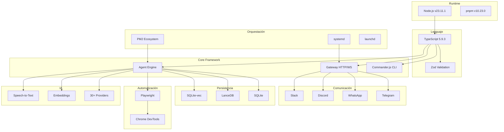

# Stack Tecnológico Completo

**ID:** DOC-SIS-STK-001
**Versión:** 2.1.0
**Fecha:** 2026-03-09
**Dependencias:** 1240+ paquetes npm

---

## Resumen Ejecutivo

OPENCLAW-system está construido sobre **OpenClaw v2026.3.8**, un framework de agentes de IA multi-plataforma desarrollado en **TypeScript puro**. El sistema aprovecha el ecosistema Node.js con pnpm como gestor de paquetes, integrando más de 1240 dependencias para ofrecer capacidades de IA conversacional, automatización de browser, memoria vectorial y comunicación multi-canal.

---

## 1. Lenguaje y Runtime

### 1.1 Lenguaje Principal

| Componente | Tecnología | Versión | Cobertura |
|------------|-----------|---------|-----------|
| **Lenguaje** | TypeScript | 5.9.3 | 100% del código |
| **Runtime** | Node.js | v23.11.1 | Producción |
| **Package Manager** | pnpm | v10.23.0 | Obligatorio |
| **Bundler** | tsdown | - | Build core |

### 1.2 ¿Por qué TypeScript?

El código base está escrito **100% en TypeScript**, proporcionando:

- **Tipado estático** con validación en tiempo de compilación
- **IntelliSense** completo para desarrollo
- **Refactoring seguro** con detección de errores
- **Documentación viva** mediante tipos
- **Integración nativa** con Zod para validación runtime

### 1.3 Comparativa de Runtimes

| Runtime | Ventajas | Desventajas | Estado |
|---------|----------|-------------|--------|
| **Node.js** | Ecosistema maduro, estabilidad, soporte LTS | Menor rendimiento que alternativas | ✅ **USADO** |
| **Deno** | Seguridad sandbox, TypeScript nativo | Ecosistema limitado, incompatibilidades | ❌ Descartado |
| **Bun** | Velocidad superior, APIs modernas | Inestabilidad en producción, breaking changes | ❌ Descartado |

**Decisión arquitectónica:** Node.js fue elegido por su **estabilidad probada** y **soporte completo** del ecosistema npm. El rendimiento de Bun no compensa los riesgos de incompatibilidad con las 1240+ dependencias.

---

## 2. Frameworks y Librerías Core

### 2.1 Validación de Datos

```typescript
// Zod: Validación type-safe en runtime
import { z } from 'zod';

const AgentConfigSchema = z.object({
  name: z.string(),
  model: z.string(),
  skills: z.array(z.string()),
  sandbox: z.boolean().default(true)
});
```

**Uso de Zod en el sistema:**
- Validación de configuración (`src/config/zod-schema.*.ts`)
- Schemas de protocolo Gateway
- Validación de inputs de usuario
- Serialización/deserialización type-safe

### 2.2 CLI (Command Line Interface)

```bash
# Commander.js: Framework CLI principal
openclaw agent start --name cko
openclaw gateway status
openclaw skills install mcporter
```

**Comandos disponibles:**
- `openclaw agent` - Gestión de agentes
- `openclaw channels` - Gestión de canales
- `openclaw config` - Configuración
- `openclaw cron` - Tareas programadas
- `openclaw daemon` - Daemon del sistema
- `openclaw gateway` - API Gateway
- `openclaw models` - Proveedores de IA
- `openclaw skills` - Sistema de skills

---

## 3. Automatización y Browser

### 3.1 Browser Automation

| Herramienta | Propósito | Uso |
|-------------|-----------|-----|
| **Playwright** | Automatización de browser | Navegación, capturas, testing |
| **Chrome DevTools Protocol** | Control nativo de Chrome | Debugging, profiling |
| **Puppeteer** | Headless Chrome legacy | Compatibilidad |

```typescript
// src/browser/pw-session.ts
import { chromium } from 'playwright-core';

const browser = await chromium.launch({
  headless: true,
  args: ['--no-sandbox']
});
```

### 3.2 Canvas y Procesamiento de Imágenes

```json
{
  "@napi-rs/canvas": "0.1.95",
  "sharp": "0.34.5"
}
```

- **@napi-rs/canvas**: Renderizado de canvas en servidor
- **sharp**: Procesamiento de imágenes de alta velocidad

---

## 4. Bases de Datos

### 4.1 Stack de Persistencia

| Base de Datos | Tipo | Uso Principal |
|---------------|------|---------------|
| **SQLite** | Relacional embebida | Configuración, sesiones, metadata |
| **PostgreSQL** | Relacional avanzada | Multi-tenant, escalabilidad (opcional) |
| **LanceDB** | Vector database | Embeddings, búsqueda semántica |
| **SQLite-vec** | Vector store embebido | Búsqueda vectorial zero-config |

### 4.2 Dependencias de BD

```json
{
  "better-sqlite3": "^11.0.0",
  "@lancedb/lancedb": "0.26.2",
  "sqlite-vec": "0.1.7-alpha.2"
}
```

> Ver documento [03-bases-de-datos.md](./03-bases-de-datos.md) para detalles completos.

---

## 5. Orquestación de Procesos

### 5.1 Gestión de Procesos

| Sistema | Plataforma | Configuración |
|---------|-----------|---------------|
| **PM2** | Multi-plataforma | Ecosystem file |
| **systemd** | Linux | `.service` units |
| **launchd** | macOS | `.plist` files |
| **schtasks** | Windows | Task Scheduler |

### 5.2 PM2 Ecosystem

```javascript
// ecosystem.config.js
module.exports = {
  apps: [
    {
      name: 'sis-director',
      script: 'dist/entry.js',
      args: '--agent director',
      instances: 1,
      exec_mode: 'fork',
      autorestart: true,
      watch: false,
      exp_backoff_restart_delay: 100
    },
    {
      name: 'sis-ejecutor',
      script: 'dist/entry.js',
      args: '--agent ejecutor',
      instances: 1,
      exec_mode: 'fork'
    },
    {
      name: 'sis-archivador',
      script: 'dist/entry.js',
      args: '--agent archivador',
      instances: 1,
      exec_mode: 'fork'
    }
  ]
};
```

> Ver documento [05-daemon-servicios.md](./05-daemon-servicios.md) para configuración completa.

---

## 6. Comunicación

### 6.1 Protocolos Soportados

| Protocolo | Puerto | Uso |
|-----------|--------|-----|
| **WebSocket** | 18789 | Comunicación real-time |
| **HTTP/HTTPS** | 18789 | API REST, WebUI |
| **Gateway API** | 18789 | OpenAI-compatible |

### 6.2 Gateway Configuration

```json
{
  "gateway": {
    "port": 18789,
    "bind": "127.0.0.1",
    "auth": {
      "token": "d91adb5e7091a088e3b1958e9dbd33f4686e7f21fef02844"
    },
    "runtime": "node"
  }
}
```

> Ver documento [../08-FLUJOS/00-comunicaciones.md](../08-FLUJOS/00-comunicaciones.md) para arquitectura de comunicación.

---

## 7. Dependencias por Categoría

### 7.1 Core del Sistema (50+ paquetes)

```json
{
  "typescript": "5.9.3",
  "zod": "^3.22.0",
  "commander": "^12.0.0",
  "fastify": "^5.0.0",
  "@fastify/websocket": "^11.0.0",
  "@fastify/cors": "^10.0.0",
  "ws": "^8.16.0"
}
```

### 7.2 Proveedores de IA (30+ paquetes)

```json
{
  "@anthropic-ai/sdk": "^0.30.0",
  "openai": "^4.70.0",
  "@google/generative-ai": "^0.21.0",
  "@mistralai/mistralai": "^1.0.0",
  "@xai-sdk/client": "^1.0.0"
}
```

> Ver documento [02-modelos-ia.md](./02-modelos-ia.md) para listado completo.

### 7.3 Canales de Comunicación (20+ paquetes)

```json
{
  "grammy": "1.41.1",
  "@discordjs/voice": "0.19.0",
  "@slack/bolt": "4.6.0",
  "@whiskeysockets/baileys": "7.0.0-rc.9",
  "@matrix-org/matrix-sdk-crypto-nodejs": "0.4.0"
}
```

### 7.4 Automatización (15+ paquetes)

```json
{
  "playwright-core": "1.58.2",
  "puppeteer": "^22.0.0",
  "@puppeteer/browsers": "^2.0.0"
}
```

### 7.5 Utilidades (100+ paquetes)

```json
{
  "sharp": "0.34.5",
  "marked": "^12.0.0",
  "highlight.js": "^11.9.0",
  "date-fns": "^3.0.0",
  "lodash-es": "^4.17.0"
}
```

### 7.6 Testing (10+ paquetes)

```json
{
  "vitest": "4.0.18",
  "@vitest/coverage-v8": "^4.0.0",
  "playwright-test": "^14.0.0"
}
```

> Ver documento [../14-DESARROLLO/01-testing.md](../14-DESARROLLO/01-testing.md) para estrategia de testing.

---

## 8. Build System

### 8.1 Scripts de Build

```json
{
  "scripts": {
    "build": "pnpm canvas:a2ui:bundle && node scripts/tsdown-build.mjs",
    "build:core": "node scripts/tsdown-build.mjs",
    "dev": "tsx watch src/entry.ts",
    "test": "vitest",
    "lint": "eslint src/"
  }
}
```

### 8.2 Build Core-Only (Producción)

```bash
# Compilar solo el núcleo (saltando UI problemática)
node scripts/tsdown-build.mjs && \
node scripts/copy-plugin-sdk-root-alias.mjs && \
node --import tsx scripts/write-build-info.ts

# Vincular globalmente
sudo npm link --force
```

---

## 9. Diagrama de Stack



---

## 10. Versiones de Producción

| Componente | Versión | Estado |
|------------|---------|--------|
| OpenClaw | 2026.3.8 | ✅ Estable |
| Node.js | v23.11.1 | ✅ LTS |
| npm | 10.9.2 | ✅ Incluido |
| pnpm | 10.23.0 | ✅ Requerido |
| TypeScript | 5.9.3 | ✅ Compilado |
| vitest | 4.0.18 | ✅ Testing |

---

## 11. Referencias Cruzadas

- **Integración OpenClaw:** [../02-INSTANCIAS/00-openclaw-integracion.md](../02-INSTANCIAS/00-openclaw-integracion.md)
- **Proveedores de IA:** [02-modelos-ia.md](./02-modelos-ia.md)
- **Bases de Datos:** [03-bases-de-datos.md](./03-bases-de-datos.md)
- **Comunicaciones:** [../08-FLUJOS/00-comunicaciones.md](../08-FLUJOS/00-comunicaciones.md)
- **Daemon y Servicios:** [05-daemon-servicios.md](./05-daemon-servicios.md)
- **Testing:** [../14-DESARROLLO/01-testing.md](../14-DESARROLLO/01-testing.md)

---

**Documento:** Stack Tecnológico Completo
**Ubicación:** `docs/01-SISTEMA/01-stack-tecnologico.md`
**Versión:** 2.1.0
**Fecha:** 2026-03-09
