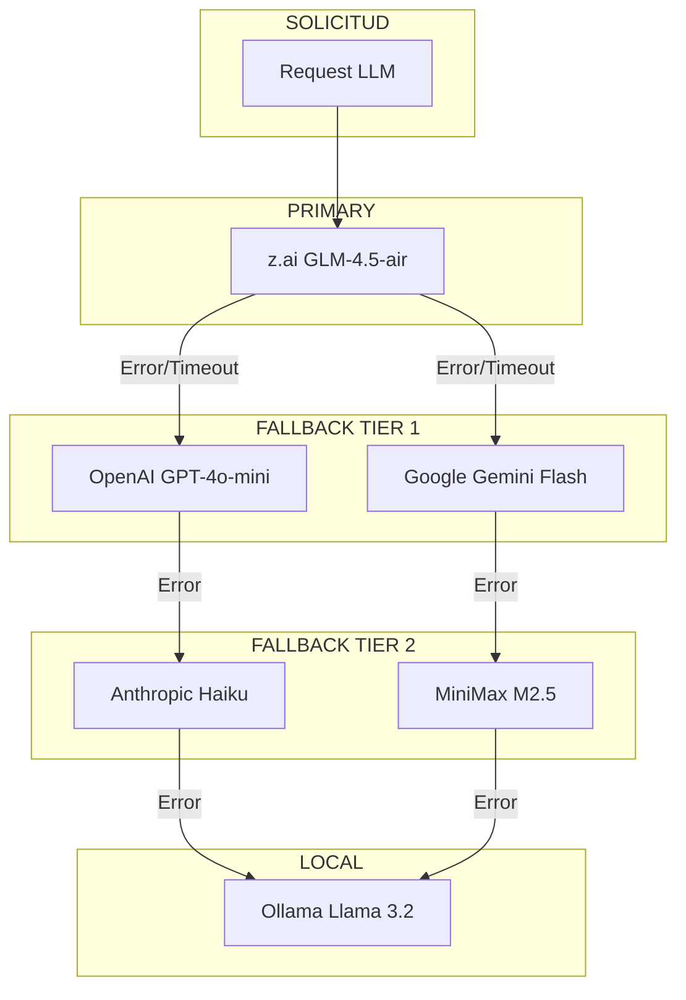
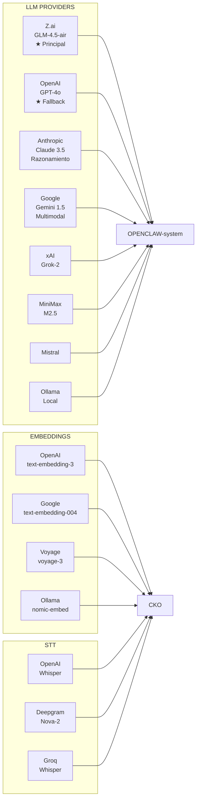

# Proveedores de IA SOTA

**ID:** DOC-SIS-MOD-001
**Versión:** 2.1.0
**Fecha:** 2026-03-09
**Modelo Principal:** z.ai/glm-4.5-air

---

## Resumen Ejecutivo

OPENCLAW-system integra **30+ proveedores de IA** mediante la arquitectura modular de OpenClaw. El sistema soporta modelos de lenguaje (LLMs), embeddings para búsqueda semántica, y speech-to-text (STT) para transcripción de audio. La estrategia de fallback automático garantiza alta disponibilidad con costos optimizados.

---

## 1. Proveedores de LLM Soportados

### 1.1 Tabla Comparativa Principal

| Proveedor | Modelos Principales | Contexto | Costo/1M tokens | Latencia | Uso |
|-----------|---------------------|----------|-----------------|----------|-----|
| **Z.ai** | glm-4.5-air, glm-4-plus | 128K | ~$0.15 | 500ms | ★ Principal |
| **OpenAI** | GPT-4o, GPT-4o-mini, GPT-3.5 | 128K | $2.50/$0.15 | 800ms | ★ Fallback |
| **Anthropic** | Claude 3.5 Sonnet, Haiku | 200K | $3.00/$0.25 | 600ms | Razonamiento |
| **Google** | Gemini 1.5 Pro, Flash | 1M | $1.25/$0.075 | 700ms | Multimodal |
| **xAI** | Grok-2, Grok-beta | 128K | Variable | 500ms | Alternativo |
| **MiniMax** | M2.5-highspeed | 205K | ~$0.20 | 300ms | ★ Ejecutor |
| **Mistral** | Mistral Large, Medium | 128K | $2.00/$0.20 | 400ms | Europa |
| **Ollama** | Llama 3.2, Qwen2.5 | Variable | Gratis | Variable | Local |

### 1.2 Configuración por Proveedor

#### Z.ai (Modelo Principal)

```json
{
  "zai": {
    "models": ["glm-4.5-air", "glm-4-plus"],
    "contextWindow": 128000,
    "features": ["chat", "streaming"],
    "apiKey": "${ZAI_API_KEY}",
    "baseUrl": "https://open.bigmodel.cn/api/paas/v4"
  }
}
```

**Características:**
- Modelo GLM-4.5 optimizado para español
- Excelente relación costo-rendimiento
- Baja latencia (~500ms)
- Ideal para tareas operativas

#### OpenAI (Fallback Principal)

```json
{
  "openai": {
    "models": ["gpt-4o", "gpt-4o-mini", "gpt-3.5-turbo"],
    "contextWindow": 128000,
    "features": ["chat", "vision", "function_calling", "streaming"],
    "apiKey": "${OPENAI_API_KEY}"
  }
}
```

**Características:**
- Máxima compatibilidad con tools
- Vision multimodal incluido
- Function calling robusto
- Ecosistema más maduro

#### Anthropic (Razonamiento)

```json
{
  "anthropic": {
    "models": ["claude-3-5-sonnet-20241022", "claude-3-5-haiku-20241022"],
    "contextWindow": 200000,
    "features": ["chat", "vision", "artifacts"],
    "apiKey": "${ANTHROPIC_API_KEY}"
  }
}
```

**Características:**
- Mejor para razonamiento complejo
- Contexto más largo (200K)
- Respuestas más precisas
- Ideal para Pensador

#### Google Gemini (Multimodal)

```json
{
  "google": {
    "models": ["gemini-1.5-pro", "gemini-1.5-flash"],
    "contextWindow": 1000000,
    "features": ["chat", "vision", "video", "audio"],
    "apiKey": "${GOOGLE_API_KEY}"
  }
}
```

**Características:**
- Contexto masivo (1M tokens)
- Multimodal nativo
- Muy económico en Flash
- Excelente para análisis de documentos

---

## 2. Proveedores de Embeddings

### 2.1 Comparativa de Embeddings

| Proveedor | Modelo | Dimensiones | Costo/1M | Calidad |
|-----------|--------|-------------|----------|---------|
| **OpenAI** | text-embedding-3-small | 1536 | $0.02 | ★★★★☆ |
| **OpenAI** | text-embedding-3-large | 3072 | $0.13 | ★★★★★ |
| **Google** | text-embedding-004 | 768 | $0.01 | ★★★★☆ |
| **Mistral** | mistral-embed | 1024 | $0.10 | ★★★☆☆ |
| **Voyage** | voyage-3 | 1024 | $0.12 | ★★★★★ |
| **Ollama** | nomic-embed-text | 768 | Gratis | ★★★☆☆ |

### 2.2 Configuración de Embeddings

```typescript
// src/memory/embeddings.ts
const embeddingsConfig = {
  primary: {
    provider: "openai",
    model: "text-embedding-3-small",
    dimensions: 1536
  },
  fallback: {
    provider: "ollama",
    model: "nomic-embed-text",
    dimensions: 768
  },
  local: {
    provider: "ollama",
    model: "nomic-embed-text"
  }
};
```

### 2.3 Uso en OPENCLAW-system

```typescript
// Configuración por rol del tri-agente
const gearEmbeddings = {
  director: "openai/text-embedding-3-small",   // Calidad
  ejecutor: "google/text-embedding-004",       // Velocidad
  archivador: "openai/text-embedding-3-large"  // Precisión
};
```

---

## 3. Proveedores de STT (Speech-to-Text)

### 3.1 Comparativa de STT

| Proveedor | Modelo | Idiomas | Costo/min | Precisión |
|-----------|--------|---------|-----------|-----------|
| **OpenAI** | whisper-1 | 50+ | $0.006 | ★★★★★ |
| **Google** | chirp | 125+ | $0.006 | ★★★★☆ |
| **Deepgram** | nova-2 | 36+ | $0.004 | ★★★★☆ |
| **Groq** | whisper-large-v3 | 50+ | $0.003 | ★★★★☆ |
| **Assembly AI** | best | 15+ | $0.006 | ★★★★☆ |
| **ElevenLabs** | turbo | 29+ | $0.005 | ★★★☆☆ |
| **Groq** | distil-whisper | 50+ | $0.002 | ★★★☆☆ |
| **Ollama** | whisper | 50+ | Gratis | ★★★☆☆ |
| **MiniMax** | speech-01 | 10+ | Variable | ★★★☆☆ |

### 3.2 Configuración STT

```json
{
  "stt": {
    "primary": {
      "provider": "openai",
      "model": "whisper-1",
      "language": "es"
    },
    "fallback": {
      "provider": "groq",
      "model": "whisper-large-v3-turbo"
    },
    "local": {
      "provider": "ollama",
      "model": "whisper"
    }
  }
}
```

---

## 4. Estrategia de Fallback y Failover

### 4.1 Arquitectura de Fallback



### 4.2 Configuración de Fallbacks

```json
{
  "models": {
    "default": "zai/glm-4.5-air",
    "fallbacks": [
      "openai/gpt-4o-mini",
      "google/gemini-1.5-flash",
      "anthropic/claude-3-5-haiku-20241022",
      "ollama/llama3.2"
    ],
    "fallbackOn": ["timeout", "rate_limit", "error"],
    "timeout": 30000
  }
}
```

### 4.3 Lógica de Failover

```typescript
// Pseudocódigo de failover
async function callWithFallback(prompt: string): Promise<Response> {
  const providers = [
    { name: "zai", model: "glm-4.5-air", priority: 1 },
    { name: "openai", model: "gpt-4o-mini", priority: 2 },
    { name: "google", model: "gemini-1.5-flash", priority: 3 },
    { name: "ollama", model: "llama3.2", priority: 99 }
  ];
  
  for (const provider of providers.sort((a, b) => a.priority - b.priority)) {
    try {
      return await callProvider(provider, prompt, { timeout: 30000 });
    } catch (error) {
      log.warn(`Provider ${provider.name} failed, trying next...`);
      continue;
    }
  }
  
  throw new Error("All providers failed");
}
```

---

## 5. Asignación por Engranaje

### 5.1 Configuración del Tri-Agente

```yaml
# Asignación de modelos por rol
director:
  model: anthropic/claude-3-5-sonnet-20241022
  reason: "Mejor razonamiento, evita alucinaciones"
  fallback: openai/gpt-4o
  temperature: 0.1

ejecutor:
  model: zai/glm-4.5-air
  reason: "Velocidad y bajo costo para tareas operativas"
  fallback: google/gemini-1.5-flash
  temperature: 0.3

archivador:
  model: openai/gpt-4o-mini
  reason: "Balance calidad-costo para organización"
  fallback: minimax/m2.5-highspeed
  temperature: 0.2
```

### 5.2 Justificación de Asignación

| Rol | Modelo | Justificación |
|-----------|--------|---------------|
| **Director** | Claude 3.5 Sonnet | Mejor razonamiento, menor alucinación |
| **Ejecutor** | GLM-4.5-air | Velocidad, bajo costo, español nativo |
| **Archivador** | GPT-4o-mini | Económico, buena organización de texto |

---

## 6. Costos Estimados

### 6.1 Costo por 1000 Mensajes

| Escenario | Pensador | Ejecutor | Archivista | Total |
|-----------|----------|----------|------------|-------|
| **Básico** | $0.50 | $0.10 | $0.05 | **$0.65** |
| **Moderado** | $1.50 | $0.30 | $0.15 | **$1.95** |
| **Intensivo** | $5.00 | $1.00 | $0.50 | **$6.50** |

### 6.2 Optimización de Costos

```typescript
// Estrategias de optimización
const costOptimization = {
  caching: {
    enabled: true,
    ttl: 3600,  // 1 hora
    similarity: 0.95
  },
  routing: {
    simple: "ejecutor",      // Tareas simples al más barato
    complex: "pensador",     // Tareas complejas al mejor
    storage: "archivista"    // Organización al eficiente
  },
  fallback: {
    skipIfPrimarySlow: true,
    maxWaitTime: 5000
  }
};
```

---

## 7. Proveedores Adicionales

### 7.1 Lista Completa (30+)

```
PROVEEDORES SOPORTADOS:
├── OpenAI (Codex OAuth + API key)
├── Anthropic
├── Google (Gemini)
├── xAI (Grok)
├── MiniMax
├── Mistral AI
├── Moonshot AI (Kimi K2.5)
├── Volcano Engine / BytePlus
├── OpenRouter
├── Kilo Gateway
├── Qwen Portal
├── Z.AI (GLM)
├── Qianfan
├── GitHub Copilot
├── Vercel AI Gateway
├── OpenCode Zen
├── Xiaomi
├── Together AI
├── Hugging Face
├── Venice AI
├── LiteLLM
├── Cloudflare AI Gateway
├── Chutes
├── vLLM
├── Ollama (local)
├── LM Studio (local)
└── Custom Provider
```

### 7.2 Proveedores Locales

```json
{
  "local": {
    "ollama": {
      "baseUrl": "http://localhost:11434",
      "models": ["llama3.2", "qwen2.5", "mistral"],
      "gpu": true
    },
    "lmstudio": {
      "baseUrl": "http://localhost:1234/v1",
      "models": "auto"
    }
  }
}
```

---

## 8. Comandos de Gestión

```bash
# Listar modelos disponibles
openclaw models list

# Autenticar provider
openclaw models auth openai
openclaw models auth anthropic
openclaw models auth zai

# Configurar fallbacks
openclaw models fallbacks add openai/gpt-4o-mini
openclaw models fallbacks remove google/gemini-pro

# Verificar configuración
openclaw doctor --models

# Probar modelo
openclaw chat --model zai/glm-4.5-air
```

---

## 9. Diagrama de Proveedores



---

## 10. Referencias Cruzadas

- **Stack Tecnológico:** [01-stack-tecnologico.md](./01-stack-tecnologico.md)
- **Integración OpenClaw:** [../02-INSTANCIAS/00-openclaw-integracion.md](../02-INSTANCIAS/00-openclaw-integracion.md)
- **Bases de Datos:** [03-bases-de-datos.md](./03-bases-de-datos.md)
- **Seguridad:** [../11-SEGURIDAD/00-seguridad.md](../11-SEGURIDAD/00-seguridad.md)

---

**Documento:** Proveedores de IA SOTA
**Ubicación:** `docs/01-SISTEMA/02-modelos-ia.md`
**Versión:** 2.1.0
**Fecha:** 2026-03-09
