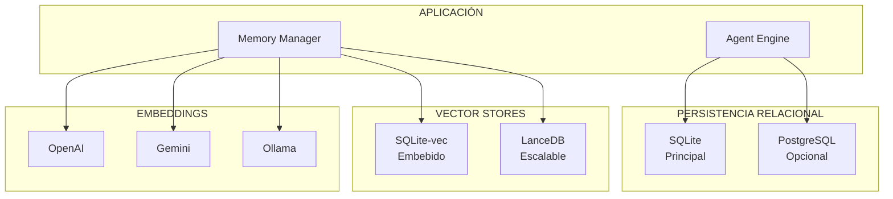
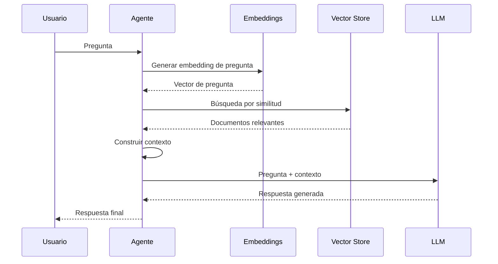

# Bases de Datos y Vector Stores

**ID:** DOC-SIS-DAT-001
**Versión:** 2.1.0
**Fecha:** 2026-03-09
**Motor Principal:** SQLite + SQLite-vec

---

## Resumen Ejecutivo

OPENCLAW-system implementa una arquitectura de persistencia **híbrida** que combina bases de datos relacionales (SQLite/PostgreSQL) con almacenes vectoriales (LanceDB, SQLite-vec) para capacidades RAG (Retrieval-Augmented Generation). Esta arquitectura permite búsqueda semántica de alta velocidad sin sacrificar la simplicidad de operación.

---

## 1. Arquitectura de Persistencia

### 1.1 Visión General



### 1.2 Roles de cada Base de Datos

| Base de Datos | Tipo | Rol Principal | Estado |
|---------------|------|---------------|--------|
| **SQLite** | Relacional embebida | Configuración, sesiones, cache | ✅ Principal |
| **PostgreSQL** | Relacional avanzada | Multi-tenant, escalabilidad | 🔲 Opcional |
| **SQLite-vec** | Vector store embebido | Búsqueda vectorial zero-config | ✅ Principal |
| **LanceDB** | Vector database | Embeddings masivos, analytics | 🔲 Opcional |

---

## 2. SQLite - Base de Datos Principal

### 2.1 Características

- **Zero-configuration**: Sin servidor, sin configuración
- **Embebida**: Base de datos en archivo único
- **Transaccional**: ACID completo
- **Eficiente**: Millones de registros sin problemas
- **Extensible**: Soporte para extensiones C

### 2.2 Estructura de Tablas

```sql
-- Configuración del sistema
CREATE TABLE config (
    key TEXT PRIMARY KEY,
    value TEXT NOT NULL,
    updated_at TIMESTAMP DEFAULT CURRENT_TIMESTAMP
);

-- Sesiones de chat
CREATE TABLE sessions (
    id TEXT PRIMARY KEY,
    agent_id TEXT NOT NULL,
    channel TEXT,
    created_at TIMESTAMP DEFAULT CURRENT_TIMESTAMP,
    updated_at TIMESTAMP DEFAULT CURRENT_TIMESTAMP,
    metadata JSON
);

-- Mensajes
CREATE TABLE messages (
    id TEXT PRIMARY KEY,
    session_id TEXT REFERENCES sessions(id),
    role TEXT NOT NULL,
    content TEXT NOT NULL,
    created_at TIMESTAMP DEFAULT CURRENT_TIMESTAMP,
    metadata JSON
);

-- Cache de respuestas
CREATE TABLE cache (
    key TEXT PRIMARY KEY,
    value TEXT NOT NULL,
    expires_at TIMESTAMP,
    created_at TIMESTAMP DEFAULT CURRENT_TIMESTAMP
);
```

### 2.3 Ubicación de Archivos

```
~/.openclaw/
├── openclaw.db              # Base de datos principal
├── agents/
│   └── main/
│       ├── sessions.db      # Sesiones del agente
│       └── memory.db        # Memoria del agente
└── vectors/
    └── embeddings.db        # Vector store
```

### 2.4 Configuración

```json
{
  "database": {
    "type": "sqlite",
    "path": "~/.openclaw/openclaw.db",
    "pragmas": {
      "journal_mode": "WAL",
      "synchronous": "NORMAL",
      "cache_size": -64000,
      "foreign_keys": true
    }
  }
}
```

---

## 3. PostgreSQL - Opción Escalable

### 3.1 Características

- **Escalabilidad**: Soporta multi-tenant con millones de usuarios
- **Extensiones**: pgvector para embeddings
- **Concurrencia**: Mejor manejo de conexiones múltiples
- **Replicación**: Master-slave para alta disponibilidad

### 3.2 Configuración

```json
{
  "database": {
    "type": "postgresql",
    "host": "localhost",
    "port": 5432,
    "database": "cko_cluster",
    "user": "cko",
    "password": "${POSTGRES_PASSWORD}",
    "pool": {
      "min": 2,
      "max": 10
    }
  }
}
```

### 3.3 Extensiones Requeridas

```sql
-- Habilitar pgvector
CREATE EXTENSION IF NOT EXISTS vector;

-- Tabla con embeddings
CREATE TABLE documents (
    id SERIAL PRIMARY KEY,
    content TEXT NOT NULL,
    embedding vector(1536),
    metadata JSONB,
    created_at TIMESTAMP DEFAULT CURRENT_TIMESTAMP
);

-- Índice para búsqueda vectorial
CREATE INDEX ON documents 
USING ivfflat (embedding vector_cosine_ops)
WITH (lists = 100);
```

---

## 4. SQLite-vec - Vector Store Embebido

### 4.1 Características

```json
{
  "sqlite-vec": {
    "version": "0.1.7-alpha.2",
    "features": [
      "Zero-configuration",
      "Embedded vector store",
      "SQLite extension",
      "HNSW indexing",
      "Cosine similarity"
    ]
  }
}
```

### 4.2 Ventajas de SQLite-vec

| Característica | Beneficio |
|----------------|-----------|
| **Zero-config** | Sin configuración adicional |
| **Embebido** | Todo en un archivo SQLite |
| **Eficiente** | Búsqueda rápida con HNSW |
| **Compatible** | Funciona con SQLite existente |
| **Ligero** | Sin dependencias externas |

### 4.3 Uso en OpenClaw

```typescript
// src/memory/sqlite-vec.ts
import { Database } from 'better-sqlite3';
import { loadVectorExt } from 'sqlite-vec';

const db = new Database('memory.db');
loadVectorExt(db);

// Crear tabla vectorial
db.exec(`
  CREATE VIRTUAL TABLE IF NOT EXISTS embeddings 
  USING vec0(
    content TEXT,
    embedding FLOAT[1536]
  )
`);

// Insertar embedding
const insert = db.prepare(`
  INSERT INTO embeddings (content, embedding)
  VALUES (?, vec_f32(?))
`);
insert.run('Documento de ejemplo', embeddingArray);

// Búsqueda por similitud
const search = db.prepare(`
  SELECT content, vec_distance_cosine(embedding, ?) as distance
  FROM embeddings
  ORDER BY distance
  LIMIT 10
`);
const results = search.all(queryEmbedding);
```

---

## 5. LanceDB - Vector Database

### 5.1 Características

```json
{
  "@lancedb/lancedb": "0.26.2",
  "features": [
    "Serverless",
    "Columnar storage",
    "Vector search",
    "Multi-modal",
    "Zero-copy"
  ]
}
```

### 5.2 Ventajas de LanceDB

| Característica | Beneficio |
|----------------|-----------|
| **Serverless** | Sin servidor que mantener |
| **Escalable** | Miles de millones de vectores |
| **Multi-modal** | Texto, imágenes, audio |
| **Rápido** | Búsqueda sub-milisegundo |
| **Versionable** | Time-travel queries |

### 5.3 Uso en OpenClaw

```typescript
// src/memory/lancedb.ts
import * as lancedb from '@lancedb/lancedb';

const db = await lancedb.connect('~/.openclaw/vectors');

// Crear tabla
const table = await db.createTable('documents', [
  { id: '1', text: 'Documento 1', vector: [0.1, 0.2, ...] }
]);

// Búsqueda vectorial
const results = await table
  .vectorSearch(queryVector)
  .limit(10)
  .toArray();
```

---

## 6. Arquitectura RAG

### 6.1 Pipeline RAG



### 6.2 Componentes RAG

```typescript
// Configuración RAG
const ragConfig = {
  embedding: {
    provider: "openai",
    model: "text-embedding-3-small",
    dimensions: 1536
  },
  vectorStore: {
    type: "sqlite-vec",
    path: "~/.openclaw/vectors/embeddings.db"
  },
  retrieval: {
    topK: 10,
    minScore: 0.7,
    reranking: true
  },
  chunking: {
    strategy: "semantic",
    maxSize: 500,
    overlap: 50
  }
};
```

---

## 7. Búsqueda Híbrida

### 7.1 Combinación de Métodos

```typescript
// src/memory/hybrid.ts
interface HybridSearchOptions {
  query: string;
  keywordWeight: number;    // 0.0 - 1.0
  semanticWeight: number;   // 0.0 - 1.0
  limit: number;
}

async function hybridSearch(options: HybridSearchOptions): Promise<Result[]> {
  const { query, keywordWeight, semanticWeight, limit } = options;
  
  // Búsqueda por palabras clave (BM25)
  const keywordResults = await keywordSearch(query, limit * 2);
  
  // Búsqueda semántica (vector)
  const queryEmbedding = await generateEmbedding(query);
  const semanticResults = await vectorSearch(queryEmbedding, limit * 2);
  
  // Fusionar resultados con pesos
  const merged = mergeResults(
    keywordResults, keywordWeight,
    semanticResults, semanticWeight
  );
  
  return merged.slice(0, limit);
}
```

### 7.2 Configuración Híbrida

```json
{
  "search": {
    "hybrid": {
      "enabled": true,
      "keywordWeight": 0.3,
      "semanticWeight": 0.7,
      "fusionMethod": "rrf"  // Reciprocal Rank Fusion
    }
  }
}
```

---

## 8. MMR (Maximal Marginal Relevance)

### 8.1 Concepto

MMR diversifica los resultados de búsqueda para evitar redundancia:

```typescript
// src/memory/mmr.ts
async function mmrSearch(
  query: string,
  options: {
    fetchK: number;      // Candidatos iniciales
    lambda: number;      // Balance relevancia-diversidad (0-1)
    limit: number;       // Resultados finales
  }
): Promise<Result[]> {
  const { fetchK, lambda, limit } = options;
  
  // Obtener candidatos
  const candidates = await vectorSearch(query, fetchK);
  const selected: Result[] = [];
  
  while (selected.length < limit && candidates.length > 0) {
    let bestScore = -Infinity;
    let bestIndex = -1;
    
    for (let i = 0; i < candidates.length; i++) {
      const relevance = candidates[i].score;
      const diversity = Math.min(
        ...selected.map(s => 1 - similarity(candidates[i].vector, s.vector))
      );
      
      const mmrScore = lambda * relevance + (1 - lambda) * diversity;
      
      if (mmrScore > bestScore) {
        bestScore = mmrScore;
        bestIndex = i;
      }
    }
    
    selected.push(candidates.splice(bestIndex, 1)[0]);
  }
  
  return selected;
}
```

### 8.2 Configuración MMR

```json
{
  "search": {
    "mmr": {
      "enabled": true,
      "fetchK": 50,
      "lambda": 0.7,
      "limit": 10
    }
  }
}
```

---

## 9. Proveedores de Embeddings

### 9.1 Configuración por Proveedor

```typescript
// src/memory/embeddings-*.ts

// OpenAI
const openaiEmbeddings = {
  provider: "openai",
  model: "text-embedding-3-small",
  dimensions: 1536,
  batchSize: 100,
  cost: "$0.02/1M tokens"
};

// Google Gemini
const geminiEmbeddings = {
  provider: "google",
  model: "text-embedding-004",
  dimensions: 768,
  batchSize: 100,
  cost: "$0.01/1M tokens"
};

// Mistral
const mistralEmbeddings = {
  provider: "mistral",
  model: "mistral-embed",
  dimensions: 1024,
  batchSize: 50,
  cost: "$0.10/1M tokens"
};

// Voyage
const voyageEmbeddings = {
  provider: "voyage",
  model: "voyage-3",
  dimensions: 1024,
  batchSize: 100,
  cost: "$0.12/1M tokens"
};

// Ollama (local)
const ollamaEmbeddings = {
  provider: "ollama",
  model: "nomic-embed-text",
  dimensions: 768,
  batchSize: 10,
  cost: "Gratis"
};
```

### 9.2 Comparativa de Rendimiento

| Proveedor | Latencia | Batch | Dimensiones | Calidad |
|-----------|----------|-------|-------------|---------|
| OpenAI | 100ms | 100 | 1536 | ★★★★★ |
| Gemini | 80ms | 100 | 768 | ★★★★☆ |
| Mistral | 90ms | 50 | 1024 | ★★★☆☆ |
| Voyage | 120ms | 100 | 1024 | ★★★★★ |
| Ollama | 500ms | 10 | 768 | ★★★☆☆ |

---

## 10. Backup y Migración

### 10.1 Estrategia de Backup

```bash
# Backup de SQLite
sqlite3 ~/.openclaw/openclaw.db ".backup ~/.openclaw/backups/openclaw-$(date +%Y%m%d).db"

# Backup de vectores
cp -r ~/.openclaw/vectors/ ~/.openclaw/backups/vectors-$(date +%Y%m%d)/

# Backup completo
tar -czf openclaw-backup-$(date +%Y%m%d).tar.gz ~/.openclaw/
```

### 10.2 Script de Backup Automático

```bash
#!/bin/bash
# /etc/cron.daily/openclaw-backup

BACKUP_DIR="/backups/cko"
DATE=$(date +%Y%m%d)
RETENTION_DAYS=30

# Crear directorio de backup
mkdir -p $BACKUP_DIR

# Backup de bases de datos
sqlite3 ~/.openclaw/openclaw.db ".backup $BACKUP_DIR/openclaw-$DATE.db"

# Backup de vectores
cp -r ~/.openclaw/vectors $BACKUP_DIR/vectors-$DATE/

# Comprimir
tar -czf $BACKUP_DIR/openclaw-$DATE.tar.gz -C $BACKUP_DIR openclaw-$DATE.db vectors-$DATE

# Limpiar backups antiguos
find $BACKUP_DIR -name "*.tar.gz" -mtime +$RETENTION_DAYS -delete
rm -rf $BACKUP_DIR/openclaw-$DATE.db $BACKUP_DIR/vectors-$DATE
```

### 10.3 Migración SQLite → PostgreSQL

```typescript
// scripts/migrate-to-postgres.ts
async function migrateToPostgres() {
  const sqlite = new Database('openclaw.db');
  const pg = new Pool({ connectionString: process.env.DATABASE_URL });
  
  // Migrar sesiones
  const sessions = sqlite.prepare('SELECT * FROM sessions').all();
  for (const session of sessions) {
    await pg.query(
      'INSERT INTO sessions (id, agent_id, channel, metadata) VALUES ($1, $2, $3, $4)',
      [session.id, session.agent_id, session.channel, session.metadata]
    );
  }
  
  console.log(`Migrated ${sessions.length} sessions`);
}
```

---

## 11. Comandos de Gestión

```bash
# Ver estado de bases de datos
openclaw doctor --database

# Optimizar SQLite
sqlite3 ~/.openclaw/openclaw.db "VACUUM; ANALYZE;"

# Ver tamaño de bases de datos
du -sh ~/.openclaw/*.db

# Exportar datos
sqlite3 ~/.openclaw/openclaw.db ".dump" > backup.sql

# Regenerar embeddings
openclaw memory rebuild-index
```

---

## 12. Referencias Cruzadas

- **Stack Tecnológico:** [01-stack-tecnologico.md](./01-stack-tecnologico.md)
- **Proveedores de IA:** [02-modelos-ia.md](./02-modelos-ia.md)
- **Almacenamiento:** [04-almacenamiento.md](./04-almacenamiento.md)
- **Seguridad:** [../11-SEGURIDAD/00-seguridad.md](../11-SEGURIDAD/00-seguridad.md)

---

**Documento:** Bases de Datos y Vector Stores
**Ubicación:** `docs/01-SISTEMA/03-bases-de-datos.md`
**Versión:** 2.1.0
**Fecha:** 2026-03-09
