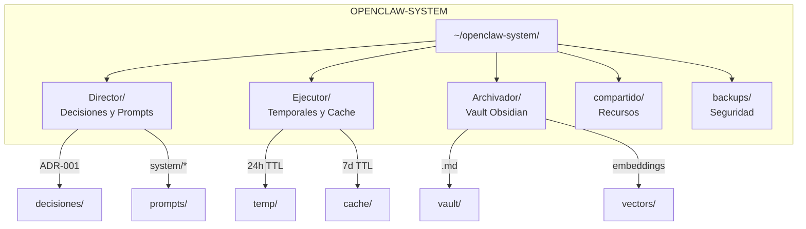

# Sistema de Archivos y Memoria

**ID:** DOC-SIS-ALM-001
**Versión:** 2.1.0
**Fecha:** 2026-03-09
**Estructura:** Tri-Agente (3 roles)

---

## Resumen Ejecutivo

OPENCLAW-system organiza su sistema de archivos según la arquitectura de **Tri-Agente**, donde cada rol (Director, Ejecutor, Archivador) tiene su propio workspace aislado. El sistema implementa políticas de rotación de logs, gestión de archivos temporales, y sincronización opcional con almacenamiento externo.

---

## 1. Estructura de Directorios

### 1.1 Visión General

```
~/openclaw-system/
├── Director/                    # Orquestador principal
│   ├── decisiones/              # Decisiones arquitectónicas (ADRs)
│   ├── prompts/                 # Prompts del sistema
│   ├── config/                  # Configuración central
│   └── logs/                    # Logs del orquestador
│
├── Ejecutor/                    # Workspace del Ejecutor
│   ├── temp/                    # Archivos temporales
│   ├── downloads/               # Descargas del agente
│   ├── uploads/                 # Archivos subidos
│   └── cache/                   # Caché de operaciones
│
├── Archivador/                  # Vault del Archivador
│   ├── vault/                   # Vault Obsidian (.md)
│   ├── vectors/                 # Vector store
│   └── exports/                 # Exportaciones
│
├── compartido/                  # Recursos compartidos
│   ├── skills/                  # Skills instaladas
│   └── tools/                   # Herramientas comunes
│
└── backups/                     # Copias de seguridad
    ├── diario/                  # Backups diarios
    └── semanal/                 # Backups semanales
```

### 1.2 Diagrama de Estructura



---

## 2. Directorio Director

### 2.1 Decisiones Arquitectónicas (ADRs)

```
Director/decisiones/
├── ADR-001-seleccion-modelos.md
├── ADR-002-arquitectura-tri-agente.md
├── ADR-003-canales-comunicacion.md
├── ADR-004-estrategia-backup.md
└── index.md
```

### 2.2 Prompts del Sistema

```
Director/prompts/
├── system/
│   ├── director.md            # Supervisor
│   ├── ejecutor.md            # Operativo
│   └── archivador.md          # Memoria
├── templates/
│   ├── investigacion.md
│   └── reporte.md
└── workflows/
    └── procesamiento-tareas.md
```

---

## 3. Directorio Ejecutor

### 3.1 Archivos Temporales

```
Ejecutor/temp/
├── sesion-{id}/               # Archivos de sesión
└── procesamiento/             # En procesamiento
```

**Política de rotación:**
- TTL máximo: 24 horas
- Limpieza automática: cada hora

### 3.2 Caché

```
Ejecutor/cache/
├── web/                       # Caché HTTP
├── embeddings/                # Caché de vectores
└── responses/                 # Caché de LLM
```

**Política de rotación:**
- TTL máximo: 7 días
- Tamaño máximo: 1 GB
- Limpieza automática: cada 6 horas

---

## 4. Directorio Archivador

### 4.1 Vault Obsidian

```
Archivador/vault/
├── entrada/                   # Entrada
├── proyectos/                 # Proyectos
├── conocimiento/              # Conocimiento
├── reuniones/                 # Reuniones
├── diario/                    # Notas diarias
├── plantillas/                # Plantillas
└── .obsidian/                 # Config Obsidian
```

### 4.2 Formato de Notas

```markdown
# 2026-03-09 - Nota Diaria

## Tareas
- [ ] Revisar documentación
- [x] Configurar backup

## Notas
- OpenClaw 2026.3.8 operativo
- Triunvirato configurado

## Referencias
- [[ADR-001-seleccion-modelos]]

#tags: #daily #cko
```

---

## 5. Políticas de Rotación de Logs

### 5.1 Configuración

```typescript
const loggingConfig = {
  rotation: {
    maxSize: "50M",
    maxFiles: 10,
    compress: true
  },
  files: {
    app: "aplicacion.log",
    error: "error.log",
    access: "acceso.log"
  }
};
```

### 5.2 Logrotate

```bash
# /etc/logrotate.d/openclaw-system
~/openclaw-system/Director/logs/*.log {
    daily
    rotate 10
    compress
    missingok
    notifempty
}
```

---

## 6. Backup y Recuperación

### 6.1 Estrategia

| Tipo | Frecuencia | Retención |
|------|-----------|-----------|
| Incremental | Diario | 7 días |
| Completo | Semanal | 4 semanas |
| Archivo | Mensual | 12 meses |

### 6.2 Comandos de Backup

```bash
# Backup manual
tar -czf backup-$(date +%Y%m%d).tar.gz ~/openclaw-system/

# Restaurar
tar -xzf backup-20260309.tar.gz -C ~/

# Verificar integridad
openclaw doctor --database
```

---

## 7. Tamaños Estimados

| Componente | Tamaño | Crecimiento |
|------------|--------|-------------|
| Director/ | ~10 MB | 1 MB/mes |
| Ejecutor/temp/ | ~100 MB | Variable |
| Ejecutor/cache/ | ~500 MB | Auto-limitado |
| Archivador/vault/ | ~50 MB | 10 MB/mes |
| backups/ | ~1 GB | 200 MB/mes |

---

## 8. Referencias Cruzadas

- **Stack Tecnológico:** [01-stack-tecnologico.md](./01-stack-tecnologico.md)
- **Bases de Datos:** [03-bases-de-datos.md](./03-bases-de-datos.md)
- **Seguridad:** [../11-SEGURIDAD/00-seguridad.md](../11-SEGURIDAD/00-seguridad.md)

---

**Documento:** Sistema de Archivos y Memoria
**Ubicación:** `docs/01-SISTEMA/04-almacenamiento.md`
**Versión:** 2.1.0
**Fecha:** 2026-03-09
