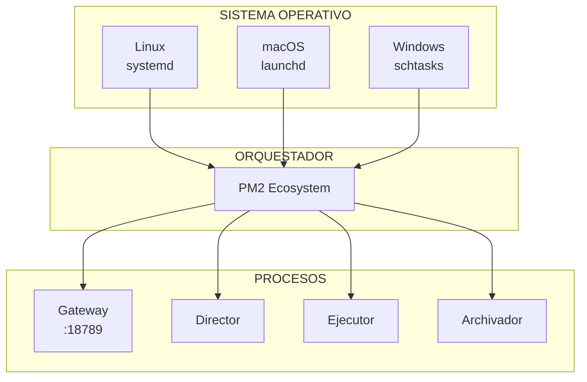

# Daemon y Servicios del Sistema

**ID:** DOC-SIS-SRV-001
**Versión:** 2.1.0
**Fecha:** 2026-03-09
**Orquestador:** PM2 Ecosystem

---

## Resumen Ejecutivo

OPENCLAW-system utiliza **PM2** como orquestador de procesos principal, complementado por los sistemas de servicios nativos de cada plataforma: **systemd** (Linux), **launchd** (macOS) y **schtasks** (Windows). Esta arquitectura garantiza alta disponibilidad con auto-restart, logs persistentes, y la capacidad de ejecutar sin necesidad de login activo (lingering).

---

## 1. Arquitectura de Servicios

### 1.1 Visión General



### 1.2 Componentes

| Componente | Función | Plataforma |
|------------|---------|------------|
| **PM2** | Orquestador principal | Multi-plataforma |
| **systemd** | Servicio del sistema | Linux |
| **launchd** | Agente/daemon | macOS |
| **schtasks** | Programador de tareas | Windows |

---

## 2. PM2 - Orquestador Principal

### 2.1 Configuración Ecosystem

```javascript
// ecosystem.config.js
module.exports = {
  apps: [
    {
      name: 'sis-gateway',
      script: 'dist/entry.js',
      args: 'gateway start',
      instances: 1,
      exec_mode: 'fork',
      autorestart: true,
      watch: false,
      max_memory_restart: '500M',
      exp_backoff_restart_delay: 100,
      env: {
        NODE_ENV: 'production',
        LOG_LEVEL: 'info'
      }
    },
    {
      name: 'sis-director',
      script: 'dist/entry.js',
      args: 'agent start --name director',
      instances: 1,
      exec_mode: 'fork',
      autorestart: true,
      max_memory_restart: '300M',
      exp_backoff_restart_delay: 100,
      env: {
        AGENT_ROLE: 'supervisor',
        SANDBOX_LEVEL: 'strict'
      }
    },
    {
      name: 'sis-ejecutor',
      script: 'dist/entry.js',
      args: 'agent start --name ejecutor',
      instances: 1,
      exec_mode: 'fork',
      autorestart: true,
      max_memory_restart: '500M',
      exp_backoff_restart_delay: 100,
      env: {
        AGENT_ROLE: 'executor',
        SANDBOX_LEVEL: 'docker'
      }
    },
    {
      name: 'sis-archivador',
      script: 'dist/entry.js',
      args: 'agent start --name archivador',
      instances: 1,
      exec_mode: 'fork',
      autorestart: true,
      max_memory_restart: '300M',
      exp_backoff_restart_delay: 100,
      env: {
        AGENT_ROLE: 'archivist',
        SANDBOX_LEVEL: 'strict'
      }
    }
  ]
};
```

### 2.2 Características de PM2

| Feature | Configuración | Propósito |
|---------|---------------|-----------|
| **Fork Mode** | `exec_mode: 'fork'` | Procesos independientes |
| **Auto-restart** | `autorestart: true` | Recuperación automática |
| **Exp backoff** | `exp_backoff_restart_delay: 100` | Evitar loops de restart |
| **Memory limit** | `max_memory_restart` | Prevenir memory leaks |
| **Non-interactive** | CLI flag | Sin TUI en producción |

### 2.3 Comandos PM2

```bash
# Iniciar todos los procesos
pm2 start ecosystem.config.js

# Ver estado
pm2 status

# Logs en tiempo real
pm2 logs

# Logs de un proceso específico
pm2 logs sis-director

# Reiniciar proceso
pm2 restart sis-ejecutor

# Detener todo
pm2 stop all

# Guardar configuración
pm2 save

# Generar script de startup
pm2 startup
```

---

## 3. Systemd (Linux)

### 3.1 Unit File

```ini
# ~/.config/systemd/user/openclaw-gateway.service
[Unit]
Description=OpenClaw Gateway Service
Documentation=https://github.com/openclaw/openclaw
After=network.target

[Service]
Type=simple
ExecStart=/usr/bin/node /root/openclaw/dist/entry.js gateway start --non-interactive
Restart=always
RestartSec=10
StandardOutput=append:/root/.openclaw/logs/gateway.log
StandardError=append:/root/.openclaw/logs/gateway-error.log

# Environment
Environment=NODE_ENV=production
Environment=PATH=/usr/local/bin:/usr/bin:/bin

# Security hardening
NoNewPrivileges=true
PrivateTmp=true

[Install]
WantedBy=default.target
```

### 3.2 Habilitar Lingering

```bash
# Permitir que los servicios corran sin login
loginctl enable-linger $USER

# Verificar
ls /var/lib/systemd/linger
```

### 3.3 Comandos Systemd

```bash
# Recargar configuración
systemctl --user daemon-reload

# Habilitar servicio
systemctl --user enable openclaw-gateway

# Iniciar servicio
systemctl --user start openclaw-gateway

# Ver estado
systemctl --user status openclaw-gateway

# Ver logs
journalctl --user -u openclaw-gateway -f

# Reiniciar
systemctl --user restart openclaw-gateway
```

---

## 4. Launchd (macOS)

### 4.1 Plist File

```xml
<?xml version="1.0" encoding="UTF-8"?>
<!DOCTYPE plist PUBLIC "-//Apple//DTD PLIST 1.0//EN" "http://www.apple.com/DTDs/PropertyList-1.0.dtd">
<plist version="1.0">
<dict>
    <key>Label</key>
    <string>com.openclaw.gateway</string>
    
    <key>ProgramArguments</key>
    <array>
        <string>/usr/local/bin/node</string>
        <string>/Users/ruben/openclaw/dist/entry.js</string>
        <string>gateway</string>
        <string>start</string>
        <string>--non-interactive</string>
    </array>
    
    <key>RunAtLoad</key>
    <true/>
    
    <key>KeepAlive</key>
    <true/>
    
    <key>StandardOutPath</key>
    <string>/Users/ruben/.openclaw/logs/gateway.log</string>
    
    <key>StandardErrorPath</key>
    <string>/Users/ruben/.openclaw/logs/gateway-error.log</string>
    
    <key>EnvironmentVariables</key>
    <dict>
        <key>NODE_ENV</key>
        <string>production</string>
        <key>PATH</key>
        <string>/usr/local/bin:/usr/bin:/bin</string>
    </dict>
</dict>
</plist>
```

### 4.2 Ubicación

```
~/Library/LaunchAgents/com.openclaw.gateway.plist
```

### 4.3 Comandos Launchd

```bash
# Cargar servicio
launchctl load ~/Library/LaunchAgents/com.openclaw.gateway.plist

# Descargar servicio
launchctl unload ~/Library/LaunchAgents/com.openclaw.gateway.plist

# Ver estado
launchctl list | grep openclaw

# Iniciar
launchctl start com.openclaw.gateway

# Detener
launchctl stop com.openclaw.gateway
```

---

## 5. Schtasks (Windows)

### 5.1 Configuración XML

```xml
<?xml version="1.0" encoding="UTF-16"?>
<Task version="1.2">
  <Triggers>
    <BootTrigger>
      <Enabled>true</Enabled>
    </BootTrigger>
  </Triggers>
  <Principals>
    <Principal id="Author">
      <UserId>S-1-5-18</UserId>
      <RunLevel>HighestAvailable</RunLevel>
    </Principal>
  </Principals>
  <Settings>
    <MultipleInstancesPolicy>IgnoreNew</MultipleInstancesPolicy>
    <DisallowStartIfOnBatteries>false</DisallowStartIfOnBatteries>
    <StopIfGoingOnBatteries>false</StopIfGoingOnBatteries>
    <AllowHardTerminate>true</AllowHardTerminate>
    <StartWhenAvailable>true</StartWhenAvailable>
    <RunOnlyIfNetworkAvailable>false</RunOnlyIfNetworkAvailable>
    <AllowStartOnDemand>true</AllowStartOnDemand>
    <Enabled>true</Enabled>
    <Hidden>true</Hidden>
    <RunOnlyIfIdle>false</RunOnlyIfIdle>
    <WakeToRun>false</WakeToRun>
    <ExecutionTimeLimit>PT72H</ExecutionTimeLimit>
    <Priority>7</Priority>
  </Settings>
  <Actions Context="Author">
    <Exec>
      <Command>node</Command>
      <Arguments>C:\openclaw\dist\entry.js gateway start --non-interactive</Arguments>
    </Exec>
  </Actions>
</Task>
```

### 5.2 Comandos Schtasks

```powershell
# Crear tarea
schtasks /Create /XML openclaw-gateway.xml /TN "OpenClaw Gateway"

# Iniciar tarea
schtasks /Run /TN "OpenClaw Gateway"

# Ver estado
schtasks /Query /TN "OpenClaw Gateway"

# Detener tarea
schtasks /End /TN "OpenClaw Gateway"

# Eliminar tarea
schtasks /Delete /TN "OpenClaw Gateway"
```

---

## 6. Logs Persistentes

### 6.1 Estructura de Logs

```
~/.openclaw/logs/
├── gateway.log              # Log principal del gateway
├── gateway-error.log        # Errores del gateway
├── agent-director.log       # Logs del Director
├── agent-ejecutor.log       # Logs del Ejecutor
├── agent-archivador.log     # Logs del Archivador
├── access.log               # Accesos HTTP
└── audit.log                # Auditoría de seguridad
```

### 6.2 Rotación de Logs

```bash
# /etc/logrotate.d/openclaw
~/.openclaw/logs/*.log {
    daily
    rotate 10
    compress
    delaycompress
    missingok
    notifempty
    create 0640 ruben ruben
    sharedscripts
    postrotate
        pm2 reloadLogs
    endscript
}
```

---

## 7. Health Checks

### 7.1 Endpoint de Health

```typescript
// Health check endpoint
app.get('/health', async (req, res) => {
  const health = {
    status: 'ok',
    timestamp: new Date().toISOString(),
    uptime: process.uptime(),
    checks: {
      gateway: await checkGateway(),
      database: await checkDatabase(),
      memory: await checkMemory(),
      agents: await checkAgents()
    }
  };
  
  const allHealthy = Object.values(health.checks)
    .every(c => c.status === 'ok');
  
  res.status(allHealthy ? 200 : 503).json(health);
});
```

### 7.2 Respuesta de Health

```json
{
  "status": "ok",
  "timestamp": "2026-03-09T06:00:00.000Z",
  "uptime": 86400,
  "checks": {
    "gateway": { "status": "ok", "latency": 5 },
    "database": { "status": "ok", "connections": 2 },
    "memory": { "status": "ok", "used": "256MB", "limit": "500MB" },
    "agents": {
      "status": "ok",
      "director": "running",
      "ejecutor": "running",
      "archivador": "running"
    }
  }
}
```

### 7.3 Monitoring Script

```bash
#!/bin/bash
# scripts/health-check.sh

HEALTH_URL="http://127.0.0.1:18789/health"
ALERT_WEBHOOK="https://hooks.slack.com/services/..."

response=$(curl -s -f $HEALTH_URL)

if [ $? -ne 0 ]; then
  echo "Gateway not responding!"
  curl -X POST $ALERT_WEBHOOK -d '{"text": "OPENCLAW-system Gateway DOWN!"}'
  exit 1
fi

status=$(echo $response | jq -r '.status')
if [ "$status" != "ok" ]; then
  echo "Health check failed: $status"
  curl -X POST $ALERT_WEBHOOK -d "{\"text\": \"OPENCLAW-system unhealthy: $status\"}"
  exit 1
fi

echo "All systems healthy"
```

---

## 8. Comparativa de Sistemas

| Característica | systemd | launchd | schtasks |
|----------------|---------|---------|----------|
| **Auto-start** | ✅ | ✅ | ✅ |
| **Lingering** | ✅ | ✅ | ✅ |
| **Logs** | journalctl | Console.app | Event Viewer |
| **Dependencies** | After= | WatchPaths | Conditions |
| **Restart policy** | Restart= | KeepAlive | RestartOnFailure |
| **User services** | ✅ | ✅ | ⚠️ Limitado |

---

## 9. Scripts de Instalación

### 9.1 Instalación Linux

```bash
#!/bin/bash
# scripts/install-daemon-linux.sh

set -e

echo "Installing OpenClaw daemon for Linux..."

# Crear directorio de logs
mkdir -p ~/.openclaw/logs

# Copiar unit file
cp scripts/openclaw-gateway.service ~/.config/systemd/user/

# Recargar systemd
systemctl --user daemon-reload

# Habilitar lingering
loginctl enable-linger $USER

# Habilitar servicio
systemctl --user enable openclaw-gateway

# Iniciar servicio
systemctl --user start openclaw-gateway

echo "Daemon installed and started!"
echo "Check status: systemctl --user status openclaw-gateway"
```

### 9.2 Instalación macOS

```bash
#!/bin/bash
# scripts/install-daemon-macos.sh

set -e

echo "Installing OpenClaw daemon for macOS..."

# Crear directorios
mkdir -p ~/.openclaw/logs
mkdir -p ~/Library/LaunchAgents

# Copiar plist
cp scripts/com.openclaw.gateway.plist ~/Library/LaunchAgents/

# Cargar servicio
launchctl load ~/Library/LaunchAgents/com.openclaw.gateway.plist

echo "Daemon installed and started!"
echo "Check status: launchctl list | grep openclaw"
```

---

## 10. Comandos de Gestión Unificados

```bash
# OpenClaw CLI unificado
openclaw daemon install      # Instalar servicio del SO
openclaw daemon uninstall    # Desinstalar
openclaw daemon start        # Iniciar
openclaw daemon stop         # Detener
openclaw daemon status       # Estado
openclaw daemon logs         # Ver logs
openclaw daemon restart      # Reiniciar
```

---

## 11. Troubleshooting

### 11.1 Problemas Comunes

| Problema | Causa | Solución |
|----------|-------|----------|
| **Service won't start** | Permiso denegado | Verificar permisos de archivos |
| **Killed after logout** | Lingering disabled | `loginctl enable-linger` |
| **Logs not written** | Directorio no existe | `mkdir -p ~/.openclaw/logs` |
| **Port in use** | Otro proceso | `lsof -i :18789` |

### 11.2 Diagnóstico

```bash
# Verificar que el proceso corre
ps aux | grep openclaw

# Verificar puerto
netstat -tlnp | grep 18789

# Verificar systemd
systemctl --user status openclaw-gateway

# Verificar logs recientes
tail -100 ~/.openclaw/logs/gateway.log

# Test de conectividad
curl http://127.0.0.1:18789/health
```

---

## 12. Referencias Cruzadas

- **Stack Tecnológico:** [01-stack-tecnologico.md](./01-stack-tecnologico.md)
- **Comunicaciones:** [../08-FLUJOS/00-comunicaciones.md](../08-FLUJOS/00-comunicaciones.md)
- **Seguridad:** [../11-SEGURIDAD/00-seguridad.md](../11-SEGURIDAD/00-seguridad.md)
- **Testing:** [../14-DESARROLLO/01-testing.md](../14-DESARROLLO/01-testing.md)

---

**Documento:** Daemon y Servicios del Sistema
**Ubicación:** `docs/01-SISTEMA/05-daemon-servicios.md`
**Versión:** 2.1.0
**Fecha:** 2026-03-09
