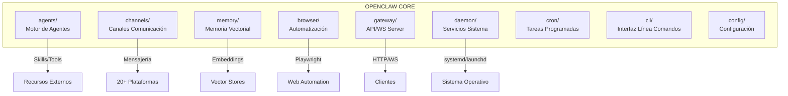
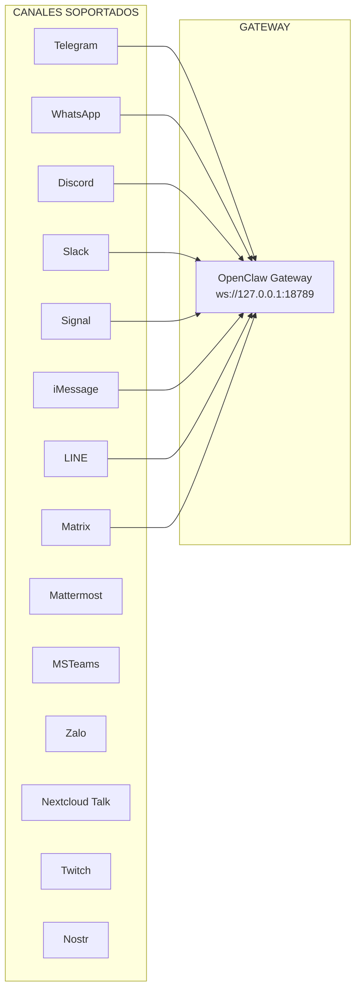
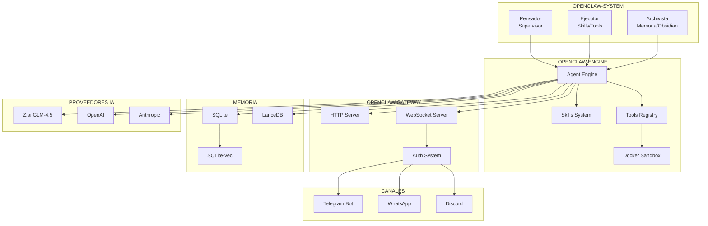

# Integración con OpenClaw v2026.3.8

**ID:** DOC-INS-INT-001
**Versión:** OpenClaw 2026.3.8
**Fecha:** 2026-03-09
**Estado:** ✅ Operativo

---

## Resumen Ejecutivo

OPENCLAW-system se integra con **OpenClaw**, un framework profesional de agentes de IA que proporciona la infraestructura base para el sistema multi-agente. OpenClaw actúa como el orquestador de los tres engranajes (Pensador, Ejecutor, Archivista) y gestiona la comunicación con canales externos, proveedores de IA y el sistema de memoria vectorial.

---

## 1. Arquitectura de OpenClaw

### 1.1 Módulos Core (9 Sistemas)



### 1.2 Descripción de Módulos

| Módulo | Directorio | Responsabilidad |
|--------|-----------|-----------------|
| **agents** | `src/agents/` | Motor de agentes, sandbox, skills, subagentes |
| **channels** | `src/channels/` | Comunicación multi-plataforma |
| **memory** | `src/memory/` | RAG, embeddings, búsqueda vectorial |
| **browser** | `src/browser/` | Automatización con Playwright/CDP |
| **gateway** | `src/gateway/` | Servidor HTTP/WebSocket |
| **daemon** | `src/daemon/` | Integración con servicios del SO |
| **cron** | `src/cron/` | Tareas programadas |
| **cli** | `src/cli/` | Interfaz de línea de comandos |
| **config** | `src/config/` | Gestión de configuración con Zod |

---

## 2. Módulos Utilizados por OPENCLAW-system

### 2.1 Agents Engine

El motor de agentes es el núcleo de OpenClaw, proporcionando:

```typescript
// Estructura del motor de agentes
src/agents/
├── sandbox/              # Sistema de sandboxing Docker
│   ├── docker.ts         # Integración Docker
│   ├── validate-sandbox-security.ts
│   └── workspace-mounts.ts
├── skills/               # Sistema de plugins
│   ├── plugin-skills.ts
│   └── workspace.ts
├── tools/                # Herramientas del agente
│   ├── browser-tool.ts
│   ├── memory-tool.ts
│   ├── web-fetch.ts
│   └── tts-tool.ts
└── subagent-*.ts         # Gestión de subagentes
```

### 2.2 Channels (Canales)

OPENCLAW-system utiliza el sistema de canales para comunicación externa:

| Canal | Uso en CKO | Estado |
|-------|-----------|--------|
| **Telegram** | Interacción principal con usuario | ✅ Activo |
| **WhatsApp** | Backup/alternativa | 🔲 Configurable |
| **Discord** | Comunicación equipo | 🔲 Configurable |
| **Slack** | Integración enterprise | 🔲 Configurable |

### 2.3 Memory (Sistema RAG)

```typescript
// Configuración de memoria
src/memory/
├── embeddings.ts         # Motor de embeddings
├── embeddings-openai.ts  # Provider OpenAI
├── embeddings-gemini.ts  # Provider Gemini
├── embeddings-ollama.ts  # Provider local
├── sqlite-vec.ts         # Vector store embebido
├── hybrid.ts             # Búsqueda híbrida
└── mmr.ts                # Maximal Marginal Relevance
```

### 2.4 Browser Automation

```typescript
// src/browser/
├── cdp.ts               # Chrome DevTools Protocol
├── pw-session.ts        # Sesiones Playwright
├── pw-tools-core.ts     # Herramientas core
└── profiles-service.ts  # Gestión de perfiles
```

---

## 3. Integración del Gateway

### 3.1 Configuración del Gateway

```json
// ~/.openclaw/openclaw.json
{
  "gateway": {
    "port": 18789,
    "bind": "127.0.0.1",
    "auth": {
      "mode": "token",
      "token": "d91adb5e7091a088e3b1958e9dbd33f4686e7f21fef02844"
    },
    "runtime": "node",
    "tailscale": false
  }
}
```

### 3.2 Endpoints del Gateway

| Endpoint | Protocolo | Uso |
|----------|-----------|-----|
| `/` | HTTP | WebUI de control |
| `/ws` | WebSocket | Comunicación real-time |
| `/v1/chat/completions` | HTTP | API OpenAI-compatible |
| `/api/agents` | HTTP | Gestión de agentes |
| `/api/sessions` | HTTP | Gestión de sesiones |

### 3.3 URLs de Acceso

```
Web UI:        http://127.0.0.1:18789/
Web UI Token:  http://127.0.0.1:18789/#token=d91adb...
Gateway WS:    ws://127.0.0.1:18789
```

---

## 4. Configuración de Canales

### 4.1 Telegram (Principal)

```typescript
// Configuración Telegram Bot
{
  "channels": {
    "telegram": {
      "enabled": true,
      "botToken": "TELEGRAM_BOT_TOKEN",
      "allowFrom": ["@usuario_autorizado"],
      "commands": true,
      "webhook": false
    }
  }
}
```

### 4.2 Canales Disponibles



---

## 5. Sistema de Skills y Tools

### 5.1 Skills Instaladas

| Skill | Descripción | Estado |
|-------|-------------|--------|
| **gifgrep** | Búsqueda de GIFs | ✅ Instalada |
| **blogwatcher** | Monitor RSS/Atom | ✅ Instalada |
| **mcporter** | Cliente MCP (oro puro) | ⏳ Pendiente pnpm |
| **obsidian** | Vaults de Obsidian | ⏳ Pendiente |

### 5.2 Tools del Agente

```typescript
// Herramientas disponibles en src/agents/tools/
├── browser-tool.ts      # Navegación web
├── canvas-tool.ts       # Manipulación de imágenes
├── cron-tool.ts         # Tareas programadas
├── gateway-tool.ts      # Llamadas al gateway
├── image-tool.ts        # Procesamiento de imágenes
├── memory-tool.ts       # Memoria del agente
├── message-tool.ts      # Envío de mensajes
├── nodes-tool.ts        # Gestión de nodos
├── pdf-tool.ts          # Procesamiento de PDFs
├── tts-tool.ts          # Text-to-Speech
├── web-fetch.ts         # Fetch de URLs
└── web-search.ts        # Búsqueda web
```

### 5.3 Estructura de una Skill

```yaml
# skill.yaml (ejemplo)
name: blogwatcher
description: Monitor de blogs y feeds RSS/Atom
version: 1.0.0
author: openclaw

tools:
  - name: subscribe_feed
    description: Suscribirse a un feed RSS
    parameters:
      url: string
      interval: number
      
  - name: get_updates
    description: Obtener actualizaciones de feeds
```

---

## 6. Configuración de Proveedores de IA

### 6.1 Proveedores Configurados

```json
{
  "models": {
    "default": "zai/glm-4.5-air",
    "fallback": "openai/gpt-4o-mini",
    "providers": {
      "zai": {
        "apiKey": "${ZAI_API_KEY}",
        "models": ["glm-4.5-air", "glm-4-plus"]
      },
      "openai": {
        "apiKey": "${OPENAI_API_KEY}",
        "models": ["gpt-4o", "gpt-4o-mini"]
      },
      "anthropic": {
        "apiKey": "${ANTHROPIC_API_KEY}",
        "models": ["claude-3-5-sonnet-20241022"]
      }
    }
  }
}
```

### 6.2 Comandos de Configuración

```bash
# Ver modelos disponibles
openclaw models list

# Configurar provider
openclaw models auth openai

# Configurar fallbacks
openclaw models fallbacks add openai/gpt-4o-mini
```

> Ver documento [02-modelos-ia.md](./02-modelos-ia.md) para listado completo de proveedores.

---

## 7. Build System

### 7.1 Build Core-Only

El build completo falla por A2UI (missing @types). Solución:

```bash
# Build del núcleo solamente
node scripts/tsdown-build.mjs && \
node scripts/copy-plugin-sdk-root-alias.mjs && \
node --import tsx scripts/write-build-info.ts

# Vincular globalmente
sudo npm link --force

# Verificar
openclaw --version
# Output: OpenClaw 2026.3.8
```

### 7.2 Scripts de Build

```json
{
  "scripts": {
    "build": "pnpm canvas:a2ui:bundle && node scripts/tsdown-build.mjs",
    "build:core": "node scripts/tsdown-build.mjs",
    "build:info": "node --import tsx scripts/write-build-info.ts"
  }
}
```

---

## 8. Estructura de Archivos ~/.openclaw/

```
~/.openclaw/
├── openclaw.json              # Configuración principal
├── openclaw.json.bak          # Backup automático
├── config.yaml                # Config alternativa (opcional)
└── agents/
    └── main/
        ├── agent.json         # Config del agente
        ├── sessions/
        │   └── sessions.json  # Sesiones de chat
        └── skills/
            └── installed/     # Skills instaladas
```

---

## 9. Diagrama de Integración



---

## 10. Comandos de Gestión

### 10.1 Daemon

```bash
# Estado del servicio
systemctl --user status openclaw-gateway

# Iniciar/detener
systemctl --user start openclaw-gateway
systemctl --user stop openclaw-gateway

# Habilitar auto-start
systemctl --user enable openclaw-gateway
```

### 10.2 Diagnóstico

```bash
# Verificar instalación
openclaw doctor

# Ver token de autenticación
openclaw config get gateway.auth.token

# Auditoría de seguridad
openclaw security audit --deep

# Abrir dashboard
openclaw dashboard --no-open
```

### 10.3 Skills

```bash
# Listar skills disponibles
openclaw skills list

# Instalar skill
openclaw skills install mcporter

# Verificar dependencias
openclaw doctor --skills
```

---

## 11. Referencias Cruzadas

- **Stack Tecnológico:** [../01-SISTEMA/01-stack-tecnologico.md](../01-SISTEMA/01-stack-tecnologico.md)
- **Proveedores de IA:** [../01-SISTEMA/02-modelos-ia.md](../01-SISTEMA/02-modelos-ia.md)
- **Bases de Datos:** [../01-SISTEMA/03-bases-de-datos.md](../01-SISTEMA/03-bases-de-datos.md)
- **Comunicaciones:** [../08-FLUJOS/00-comunicaciones.md](../08-FLUJOS/00-comunicaciones.md)
- **Seguridad:** [../11-SEGURIDAD/00-seguridad.md](../11-SEGURIDAD/00-seguridad.md)
- **Daemon y Servicios:** [../01-SISTEMA/05-daemon-servicios.md](../01-SISTEMA/05-daemon-servicios.md)

---

*Documento generado para OPENCLAW-system v1.0 - 2026-03-09*
