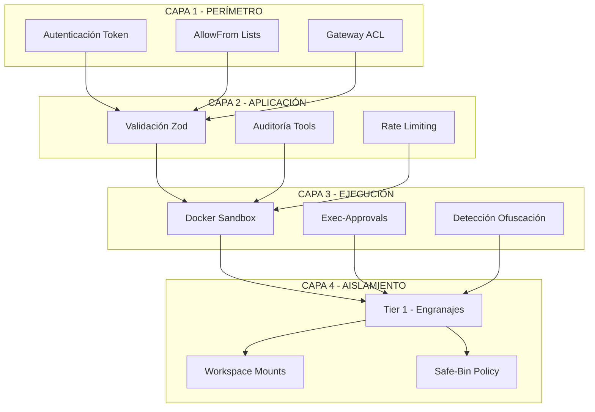
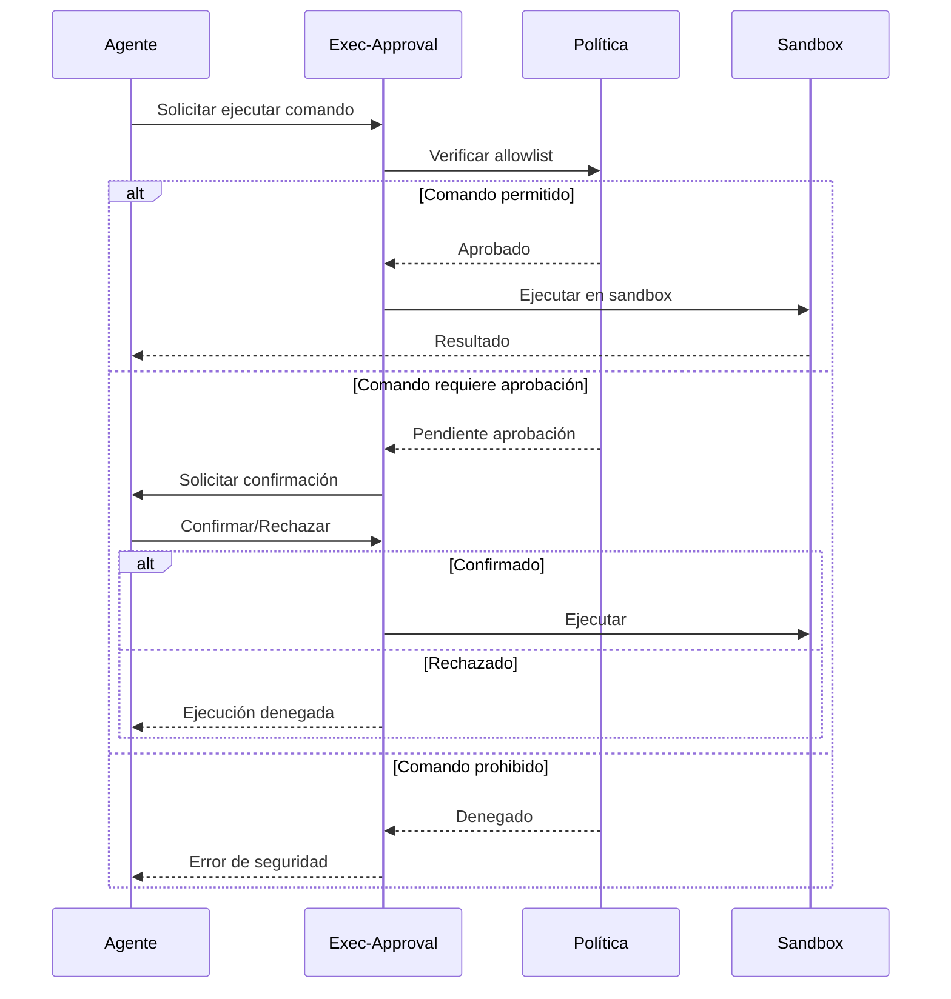

# Seguridad y Sandboxing

**ID:** DOC-SEG-SAN-001
**Versión:** OPENCLAW-system v1.0
**Fecha:** 2026-03-09
**Nivel de Aislamiento:** Tier 1 (Sandbox Docker)

---

## Resumen Ejecutivo

OPENCLAW-system implementa un modelo de seguridad de **múltiples capas** que incluye sandboxing con Docker, sistema de aprobación de comandos (Exec-Approvals), detección de código ofuscado, y políticas de bins seguros. La arquitectura del Triunvirato proporciona aislamiento adicional entre engranajes, limitando el impacto de posibles compromisos.

---

## 1. Arquitectura de Seguridad

### 1.1 Capas de Protección



### 1.2 Componentes de Seguridad

| Componente | Ubicación | Función |
|------------|-----------|---------|
| **Gateway Auth** | `src/gateway/auth.ts` | Autenticación de conexiones |
| **Exec-Approvals** | `src/infra/exec-approvals.ts` | Aprobación de comandos |
| **Safe-Bin Policy** | `src/infra/exec-safe-bin-policy.ts` | Binarios permitidos |
| **Obfuscation Detect** | `src/infra/exec-obfuscation-detect.ts` | Detección de código malicioso |
| **Sandbox Docker** | `src/agents/sandbox/docker.ts` | Aislamiento de ejecución |
| **Tool Audit** | `src/security/audit-tool-policy.ts` | Auditoría de herramientas |

---

## 2. Sandbox Docker

### 2.1 Configuración del Sandbox

```typescript
// src/agents/sandbox/docker.ts
const sandboxConfig = {
  image: "openclaw-sandbox:latest",
  networkMode: "none",           // Sin red por defecto
  memory: "512m",                // Límite de memoria
  cpus: 1,                       // Límite de CPU
  timeout: 30000,                // Timeout de ejecución
  user: "nobody",                // Usuario no privilegiado
  readOnlyRootFilesystem: true,  // FS root de solo lectura
  capDrop: ["ALL"],              // Sin capacidades Linux
  securityOpt: ["no-new-privileges"]
};
```

### 2.2 Workspace Mounts Controlados

```typescript
// src/agents/sandbox/workspace-mounts.ts
const mountPolicy = {
  allowed: [
    "/workspace/data:ro",        // Solo lectura
    "/workspace/temp:rw"         // Lectura/escritura temporal
  ],
  denied: [
    "/etc", "/var", "/root", "/home"
  ],
  maxWorkspaceSize: "100MB"
};
```

### 2.3 Validación Previa

```typescript
// src/agents/sandbox/validate-sandbox-security.ts
function validateSandboxSecurity(config: SandboxConfig): ValidationResult {
  const checks = [
    checkNetworkIsolation(config),
    checkMemoryLimits(config),
    checkUserPrivileges(config),
    checkFilesystemMounts(config),
    checkCapabilityDropping(config)
  ];
  
  return {
    valid: checks.every(c => c.passed),
    issues: checks.filter(c => !c.passed)
  };
}
```

---

## 3. Sistema Exec-Approvals

### 3.1 Flujo de Aprobación



### 3.2 Categorías de Comandos

```typescript
// src/infra/exec-approvals-allowlist.ts
const commandCategories = {
  safe: [
    "ls", "cat", "head", "tail", "grep", "wc",
    "echo", "date", "pwd", "whoami"
  ],
  requiresApproval: [
    "rm", "mv", "cp", "chmod", "chown",
    "curl", "wget", "npm", "pip"
  ],
  prohibited: [
    "sudo", "su", "passwd", "shadow",
    "dd", "mkfs", "fdisk", "shutdown"
  ]
};
```

### 3.3 Configuración de Aprobación

```json
{
  "execApprovals": {
    "mode": "interactive",
    "defaultTimeout": 30000,
    "autoApprove": {
      "safe": true,
      "requiresApproval": false,
      "prohibited": false
    },
    "logAll": true,
    "auditPath": "~/.openclaw/audit/exec.log"
  }
}
```

---

## 4. Detección de Código Ofuscado

### 4.1 Patrones Detectados

```typescript
// src/infra/exec-obfuscation-detect.ts
const obfuscationPatterns = [
  // Base64 encoding
  /base64\s*-\d*\s*[^|]*\|/i,
  /eval\s*\(\s*atob\s*\(/i,
  
  // Hex encoding
  /\\x[0-9a-f]{2}/i,
  /fromCharCode/i,
  
  // Comando encadenado sospechoso
  /\|\|\s*curl\s/i,
  /&&\s*wget\s/i,
  
  // Redirección sospechosa
  />\s*\/dev\/tcp\//i,
  />\s*\/dev\/udp\//i,
  
  // Expansión de variables sospechosa
  /\$\(\s*[^)]*\$\{/i,
  /\`\s*[^`]*\$\{/i
];
```

### 4.2 Análisis de Código

```typescript
function detectObfuscation(code: string): ObfuscationResult {
  const detected: Pattern[] = [];
  
  for (const pattern of obfuscationPatterns) {
    if (pattern.test(code)) {
      detected.push({
        pattern: pattern.source,
        severity: "high",
        message: "Posible código ofuscado detectado"
      });
    }
  }
  
  // Verificar longitud sospechosa
  if (code.length > 10000 && code.split('\n').length < 5) {
    detected.push({
      pattern: "long-oneliner",
      severity: "medium",
      message: "Comando inusualmente largo en una línea"
    });
  }
  
  return {
    safe: detected.length === 0,
    detected,
    recommendation: detected.length > 0 ? "Rechazar ejecución" : "Permitir"
  };
}
```

---

## 5. Política de Bins Seguros

### 5.1 Configuración

```typescript
// src/infra/exec-safe-bin-policy.ts
const safeBinPolicy = {
  allowedPaths: [
    "/usr/bin",
    "/bin",
    "/usr/local/bin"
  ],
  blockedBins: [
    "nc", "netcat", "telnet",
    "ftp", "tftp",
    "nmap", "masscan",
    "hydra", "john"
  ],
  requireHash: [
    "/usr/bin/sudo",  // Solo si hash coincide
    "/usr/bin/docker"
  ]
};
```

### 5.2 Verificación de Hash

```typescript
async function verifyBinHash(binaryPath: string): Promise<boolean> {
  const knownHashes = {
    "/usr/bin/sudo": "sha256:abc123...",
    "/usr/bin/docker": "sha256:def456..."
  };
  
  const actualHash = await computeHash(binaryPath);
  const expectedHash = knownHashes[binaryPath];
  
  if (!expectedHash) return true;
  return actualHash === expectedHash;
}
```

---

## 6. Auditoría de Herramientas

### 6.1 Clasificación de Tools

```typescript
// src/security/audit-tool-policy.ts
const toolClassification = {
  safe: [
    "memory-tool",
    "web-fetch",
    "image-tool"
  ],
  moderate: [
    "browser-tool",
    "pdf-tool",
    "cron-tool"
  ],
  dangerous: [
    "shell-exec",
    "filesystem-write",
    "nodes-tool"
  ]
};
```

### 6.2 Auditoría en Tiempo Real

```typescript
async function auditToolUse(tool: string, params: any): Promise<AuditResult> {
  const classification = toolClassification[tool] || "moderate";
  
  const auditEntry = {
    timestamp: new Date(),
    tool,
    classification,
    params: redactSensitive(params),
    agent: getCurrentAgent(),
    session: getCurrentSession()
  };
  
  await logAudit(auditEntry);
  
  if (classification === "dangerous") {
    await notifyOperator(auditEntry);
  }
  
  return {
    allowed: classification !== "prohibited",
    auditId: auditEntry.timestamp.getTime()
  };
}
```

---

## 7. Aislamiento de Engranajes (Tier 1)

### 7.1 Separación por Proceso

```yaml
# PM2 Ecosystem con aislamiento
apps:
  - name: sis-director
    script: dist/entry.js
    env:
      AGENT_ISOLATION: tier1
      ALLOWED_TOOLS: memory,gateway
      SANDBOX_LEVEL: strict
      
  - name: sis-ejecutor
    script: dist/entry.js
    env:
      AGENT_ISOLATION: tier1
      ALLOWED_TOOLS: browser,shell,filesystem
      SANDBOX_LEVEL: docker
      
  - name: sis-archivador
    script: dist/entry.js
    env:
      AGENT_ISOLATION: tier1
      ALLOWED_TOOLS: memory,vault,embeddings
      SANDBOX_LEVEL: strict
```

### 7.2 Comunicación Inter-Engranajes

```typescript
// Solo vía Gateway con validación
const interGearCommunication = {
  protocol: "R-P-V",  // Request-Process-Validate
  channels: {
    pensador_ejecutor: "validated",
    pensador_archivista: "validated",
    ejecutor_archivista: "readonly"
  },
  rateLimit: {
    maxRequests: 100,
    windowMs: 60000
  }
};
```

---

## 8. Autenticación y Autorización

### 8.1 Token de Gateway

```json
{
  "gateway": {
    "auth": {
      "mode": "token",
      "token": "${GATEWAY_TOKEN}",
      "tokenExpiry": null,
      "refreshToken": false
    }
  }
}
```

**⚠️ GENERACIÓN SEGURA DE TOKEN:**
```bash
# Generar token seguro (48 caracteres hex)
GATEWAY_TOKEN=$(openssl rand -hex 24)
echo "GATEWAY_TOKEN=$GATEWAY_TOKEN" >> ~/.openclaw/config/.env
```

**NUNCA** usar tokens hardcodeados en configuración o documentación.

### 8.2 AllowFrom (Telegram)

```json
{
  "channels": {
    "telegram": {
      "allowFrom": [
        "@usuario_autorizado",
        "123456789"
      ],
      "blockFrom": [],
      "requireMention": false,
      "groupAdminOnly": true
    }
  }
}
```

---

## 9. Encriptación de Comunicación

### 9.1 WebSocket TLS (Opcional)

```typescript
// Para comunicación externa
const tlsConfig = {
  enabled: process.env.TLS_ENABLED === "true",
  cert: process.env.TLS_CERT_PATH,
  key: process.env.TLS_KEY_PATH,
  ca: process.env.TLS_CA_PATH,
  minVersion: "TLSv1.3"
};
```

### 9.2 Loopback (Default)

```json
{
  "gateway": {
    "bind": "127.0.0.1",
    "port": 18789,
    "tls": false
  }
}
```

El Gateway está configurado por defecto en **loopback** (127.0.0.1), lo que significa que solo acepta conexiones locales. Para acceso remoto, se recomienda usar Tailscale o SSH tunneling.

---

## 10. Comparativa de Alternativas de Sandbox

| Solución | Aislamiento | Rendimiento | Complejidad | Estado |
|----------|-------------|-------------|-------------|--------|
| **Docker** | Container | 95% | Media | ✅ **USADO** |
| **gVisor** | Kernel sandbox | 90% | Alta | 🔲 Alternativa |
| **Kata Containers** | VM ligera | 80% | Alta | 🔲 Alternativa |
| **Firecracker** | MicroVM | 85% | Muy alta | 🔲 Alternativa |
| **nsjail** | Namespace jail | 92% | Media | 🔲 Alternativa |

**Decisión:** Docker fue elegido por su **equilibrio entre aislamiento y rendimiento**, junto con su amplia adopción y facilidad de configuración.

---

## 11. Comandos de Seguridad

```bash
# Auditoría de seguridad completa
openclaw security audit --deep

# Reparar problemas automáticamente
openclaw security audit --fix

# Verificar sandbox
openclaw doctor --sandbox

# Ver lista de bins bloqueados
openclaw security bins list

# Añadir bin a allowlist
openclaw security bins allow /usr/bin/custom-tool

# Ver logs de auditoría
tail -f ~/.openclaw/audit/exec.log
```

---

## 12. Checklist de Seguridad

```markdown
## Configuración Inicial
- [ ] Cambiar token default del Gateway
- [ ] Configurar allowFrom en Telegram
- [ ] Habilitar exec-approvals
- [ ] Configurar sandbox Docker
- [ ] Revisar bins prohibidos

## Mantenimiento Regular
- [ ] Revisar logs de auditoría semanalmente
- [ ] Actualizar imágenes Docker mensualmente
- [ ] Verificar integridad de bins críticos
- [ ] Rotar tokens cada 90 días

## Respuesta a Incidentes
- [ ] Documentar procedimiento de aislamiento
- [ ] Configurar alertas de seguridad
- [ ] Preparar plan de recuperación
```

---

## 13. Referencias Cruzadas

- **Stack Tecnológico:** [../01-SISTEMA/01-stack-tecnologico.md](../01-SISTEMA/01-stack-tecnologico.md)
- **Comunicaciones:** [../08-FLUJOS/00-comunicaciones.md](../08-FLUJOS/00-comunicaciones.md)
- **Daemon y Servicios:** [../01-SISTEMA/05-daemon-servicios.md](../01-SISTEMA/05-daemon-servicios.md)

---

*Documento generado para OPENCLAW-system v1.0 - 2026-03-09*
