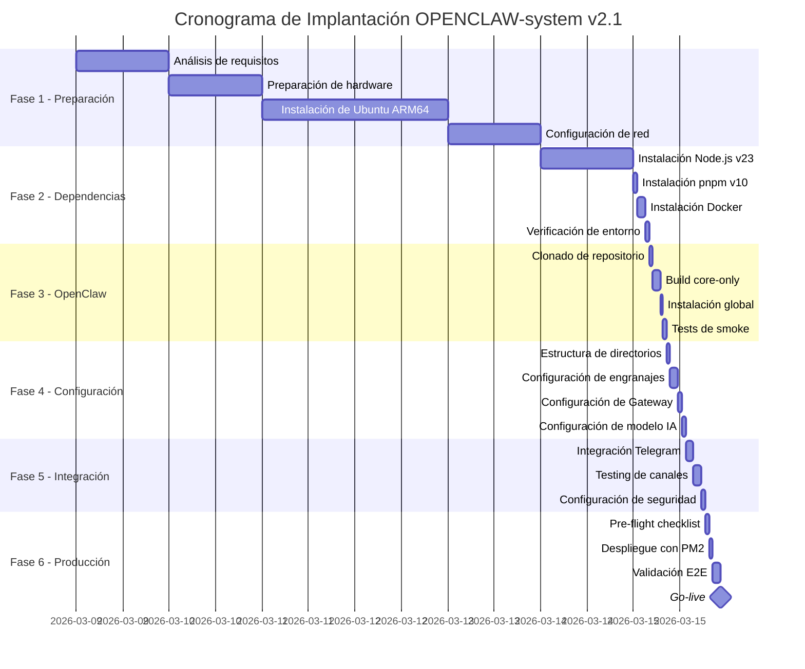

# Plan de Implantación Detallado

**ID:** DOC-IMP-PLA-001
**Versión:** 1.1
**Fecha:** Marzo 2026
**Sistema:** OPENCLAW-system (OpenClaw)
**Autor:** Equipo de Implementación OPENCLAW-system

---

## 1. Resumen Ejecutivo

Este documento presenta el plan de implantación detallado para el despliegue del **OPENCLAW-system v2.1**, una instancia de OpenClaw optimizada para procesamiento de lenguaje natural con arquitectura tri-agente (Director, Ejecutor, Archivador). El plan está estructurado en 6 fases secuenciales con hitos claramente definidos, checkpoints de validación y estrategias de mitigación de riesgos.

El OPENCLAW-system está diseñado para operar en un servidor **Ubuntu ARM64 con 16GB de RAM**, proporcionando capacidades de IA conversacional a través de múltiples canales, siendo Telegram el principal.

---

## 2. Roadmap de Implantación

### Visión General del Proyecto



### Tiempos Estimados por Fase

| Fase | Duración Estimada | Complejidad | Recursos Requeridos |
|------|-------------------|-------------|---------------------|
| Fase 1 | 3-5 días | Baja | 1 SysAdmin |
| Fase 2 | 1 día | Baja | 1 DevOps |
| Fase 3 | 4-6 horas | Media | 1 Backend Dev |
| Fase 4 | 4-5 horas | Alta | 1 Backend Dev + 1 QA |
| Fase 5 | 5-6 horas | Alta | 1 Backend Dev + 1 QA |
| Fase 6 | 4-5 horas | Crítica | 2 DevOps + 1 QA |

**Tiempo Total Estimado:** 6-8 días laborables

---

## 3. Fase 1: Preparación de Infraestructura

### 3.1 Requisitos de Hardware

| Componente | Mínimo | Recomendado | Producción |
|------------|--------|-------------|------------|
| CPU | 4 cores ARM64 | 8 cores ARM64 | 8+ cores ARM64 |
| RAM | 8 GB | 16 GB | 32 GB |
| Almacenamiento | 50 GB SSD | 100 GB SSD | 200 GB NVMe |
| Red | 100 Mbps | 1 Gbps | 1 Gbps |

### 3.2 Sistema Operativo

- **Distribución:** Ubuntu Server 22.04 LTS o 24.04 LTS
- **Arquitectura:** ARM64 (aarch64)
- **Kernel:** 5.15+ (LTS recomendado)

### 3.3 Configuración de Red

```bash
# Puertos requeridos
PORT 18789/tcp   # Gateway interno (ws://127.0.0.1:18789)
PORT 22/tcp      # SSH (acceso remoto)
PORT 443/tcp     # HTTPS (si aplica proxy reverso)
PORT 80/tcp      # HTTP (redirección a HTTPS)
```

### 3.4 Checklist Fase 1

- [ ] Servidor físicamente disponible
- [ ] Ubuntu ARM64 instalado y actualizado
- [ ] Conectividad de red verificada
- [ ] Acceso SSH configurado con claves
- [ ] Firewall configurado (ufw activo)
- [ ] Usuario no-root con privilegios sudo
- [ ] Timezone configurado (UTC recomendado)
- [ ] NTP sincronizado

---

## 4. Fase 2: Instalación de Dependencias Base

### 4.1 Stack Tecnológico Requerido

| Dependencia | Versión | Propósito |
|-------------|---------|-----------|
| Node.js | v23.11.1 | Runtime JavaScript |
| pnpm | v10.23.0 | Gestor de paquetes |
| Docker | CE 24.x+ | Contenedores (opcional) |
| Git | 2.40+ | Control de versiones |
| PM2 | 5.x | Process manager |

### 4.2 Orden de Instalación

1. **Node.js** - Runtime principal
2. **pnpm** - Gestor de paquetes optimizado
3. **Docker** - Para servicios auxiliares
4. **PM2** - Process management en producción

> **Nota:** La instalación detallada se documenta en [01-instalacion.md](./01-instalacion.md)

### 4.3 Checklist Fase 2

- [ ] Node.js v23.11.1 instalado
- [ ] pnpm v10.23.0 instalado y en PATH
- [ ] Docker CE instalado y funcionando
- [ ] Git configurado con credenciales
- [ ] PM2 instalado globalmente
- [ ] Variables de entorno configuradas

---

## 5. Fase 3: Instalación de OpenClaw

### 5.1 Proceso de Build

```bash
# Clonar repositorio
git clone https://github.com/openclaw/openclaw.git
cd openclaw

# Instalar dependencias
pnpm install --frozen-lockfile

# Build core-only (sin interfaces gráficas)
node scripts/tsdown-build.mjs

# Instalación global
npm link
```

### 5.2 Verificación de Instalación

```bash
# Verificar comando openclaw disponible
openclaw --version

# Verificar estructura de build
ls -la dist/
```

### 5.3 Checklist Fase 3

- [ ] Repositorio clonado correctamente
- [ ] Dependencias instaladas sin errores
- [ ] Build core-only completado
- [ ] Comando `openclaw` accesible globalmente
- [ ] Binarios en `dist/` verificados

---

## 6. Fase 4: Configuración del Sistema

### 6.1 Estructura de Directorios

```
/root/.openclaw/SIS_CORE/
├── config/
│   ├── default.json
│   ├── production.json
│   └── providers.json
├── data/
│   ├── memory/
│   └── knowledge/
├── logs/
│   ├── director.log
│   ├── ejecutor.log
│   └── archivador.log
├── plugins/
└── tmp/
```

### 6.2 Configuración de Engranajes

| Engranaje | Puerto | Función |
|-----------|--------|---------|
| Director | 18790 | Coordinación y routing |
| Ejecutor | 18791 | Procesamiento de mensajes |
| Archivador | 18792 | Almacenamiento y memoria |

### 6.3 Modelo Principal

- **Proveedor:** z.ai (zhipuai)
- **Modelo:** glm-4.5-air
- **Propósito:** Procesamiento de lenguaje natural principal

> **Nota:** La configuración detallada se documenta en [02-configuracion.md](./02-configuracion.md)

### 6.4 Checklist Fase 4

- [ ] Estructura de directorios creada
- [ ] Archivos de configuración generados
- [ ] Gateway configurado en puerto 18789
- [ ] Engranajes configurados con puertos únicos
- [ ] Modelo principal verificado
- [ ] Variables de entorno seguras

---

## 7. Fase 5: Integración de Canales y Servicios

### 7.1 Canales Soportados

| Canal | Tipo | Configuración |
|-------|------|---------------|
| Telegram | Bot API | Token + Webhook |
| CLI | Local | stdin/stdout |
| Gateway | WebSocket | ws://127.0.0.1:18789 |

### 7.2 Proveedores de IA Configurados

| Proveedor | Modelos | Uso |
|-----------|---------|-----|
| z.ai (zhipuai) | glm-4.5-air, glm-4-flash | Principal |
| OpenAI | gpt-4o, gpt-4o-mini | Fallback |
| Anthropic | claude-3-5-sonnet | Fallback |

### 7.3 Testing de Integración

```bash
# Test de conectividad Gateway
curl http://127.0.0.1:18789/health

# Test de bot Telegram
curl https://api.telegram.org/bot<TOKEN>/getMe
```

### 7.4 Checklist Fase 5

- [ ] Bot de Telegram creado y token obtenido
- [ ] Webhook de Telegram configurado
- [ ] Gateway respondiendo en puerto 18789
- [ ] Proveedores de IA con API keys válidas
- [ ] Comunicación entre engranajes verificada
- [ ] Flujo R-P-V (Request-Process-Validate) probado

---

## 8. Fase 6: Testing y Despliegue en Producción

### 8.1 Pre-flight Checklist

- [ ] Todos los servicios iniciando sin errores
- [ ] Logs sin errores críticos en los últimos 10 minutos
- [ ] Memoria disponible > 4GB
- [ ] CPU idle > 50%
- [ ] Conectividad con todos los proveedores de IA
- [ ] Bot de Telegram respondiendo
- [ ] Backups de configuración realizados

### 8.2 Despliegue con PM2

```bash
# Iniciar servicios
pm2 start ecosystem.config.js

# Guardar configuración
pm2 save

# Instalar startup script
pm2 startup
```

### 8.3 Validación Post-Despliegue

- Tests E2E de conversación
- Verificación de latencia < 3 segundos
- Validación de persistencia de memoria
- Pruebas de failover

> **Nota:** El proceso detallado se documenta en [03-despliegue.md](./03-despliegue.md)

---

## 9. Riesgos y Mitigaciones

| Riesgo | Probabilidad | Impacto | Mitigación |
|--------|--------------|---------|------------|
| Fallo de proveedor de IA | Media | Alto | Múltiples proveedores configurados |
| Agotamiento de memoria | Baja | Crítico | PM2 con límites de memoria, monitoreo |
| Timeout de API externa | Media | Medio | Reintentos con backoff exponencial |
| Fallo de red | Baja | Alto | Fallback a respuestas en caché |
| Corrupción de datos | Muy Baja | Crítico | Backups diarios, integridad verificada |

---

## 10. Puntos de Decisión

### Go/No-Go por Fase

| Fase | Criterio de Éxito | Decisión |
|------|-------------------|----------|
| Fase 1 | Ubuntu funcional con red | Continuar / Reparar |
| Fase 2 | Todas las dependencias instaladas | Continuar / Debuggear |
| Fase 3 | Build sin errores | Continuar / Revisar código |
| Fase 4 | Configuración validada | Continuar / Ajustar |
| Fase 5 | Tests de integración pasando | Continuar / Investigar |
| Fase 6 | Pre-flight checklist completo | **GO-LIVE** / Pausar |

### Criterios de Rollback

- Error crítico en producción
- Latencia > 10 segundos consistente
- Tasa de error > 5%
- Memoria agotada recurrentemente

---

## 11. Documentación Relacionada

- [01-instalacion.md](./01-instalacion.md) - Instalación Paso a Paso
- [02-configuracion.md](./02-configuracion.md) - Configuración Detallada
- [03-despliegue.md](./03-despliegue.md) - Despliegue en Producción
- [04-monitoreo.md](./04-monitoreo.md) - Monitoreo y Logs
- [05-mantenimiento.md](./05-mantenimiento.md) - Mantenimiento y Upgrades
- [06-failover.md](./06-failover.md) - Failover y Recuperación

---

## 12. Historial de Cambios

| Fecha | Versión | Cambio | Autor |
|-------|---------|--------|-------|
| 2026-03-09 | 1.0 | Documento inicial | Equipo Implementación |

---

*Documento generado para OPENCLAW-system v1.0*
