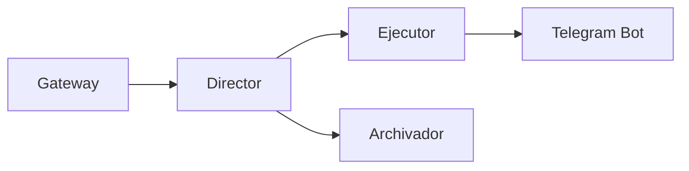

# Despliegue en Producción

**ID:** DOC-IMP-DES-001
**Versión:** 1.0
**Fecha:** Marzo 2026
**Sistema:** OPENCLAW-system (OpenClaw)

---

## 1. Introducción

Este documento describe el proceso completo de despliegue del OPENCLAW-system en producción, incluyendo verificaciones previas, secuencia de inicio, validación de servicios y estrategias de rollback.

---

## 2. Pre-flight Checklist

### 2.1 Verificaciones de Sistema

```bash
#!/bin/bash
# pre-flight-check.sh - Verificaciones antes del despliegue

echo "=== PRE-FLIGHT CHECK - OPENCLAW-system ==="

# Verificar recursos disponibles
echo -e "\n[1/8] Verificando recursos del sistema..."
FREE_MEM=$(free -m | awk '/^Mem:/{print $7}')
if [ $FREE_MEM -lt 4000 ]; then
  echo "❌ ERROR: Memoria libre insuficiente (${FREE_MEM}MB < 4000MB)"
  exit 1
fi
echo "✅ Memoria libre: ${FREE_MEM}MB"

# Verificar CPU idle
CPU_IDLE=$(top -bn1 | grep "Cpu(s)" | awk '{print $8}' | cut -d'%' -f1)
echo "✅ CPU idle: ${CPU_IDLE}%"

# Verificar espacio en disco
DISK_FREE=$(df -h / | awk 'NR==2 {print $4}')
echo "✅ Espacio en disco: ${DISK_FREE}"

# Verificar Node.js
echo -e "\n[2/8] Verificando Node.js..."
if ! command -v node &> /dev/null; then
  echo "❌ ERROR: Node.js no está instalado"
  exit 1
fi
NODE_VER=$(node --version)
echo "✅ Node.js: ${NODE_VER}"

# Verificar pnpm
echo -e "\n[3/8] Verificando pnpm..."
if ! command -v pnpm &> /dev/null; then
  echo "❌ ERROR: pnpm no está instalado"
  exit 1
fi
PNPM_VER=$(pnpm --version)
echo "✅ pnpm: ${PNPM_VER}"

# Verificar PM2
echo -e "\n[4/8] Verificando PM2..."
if ! command -v pm2 &> /dev/null; then
  echo "❌ ERROR: PM2 no está instalado"
  exit 1
fi
PM2_VER=$(pm2 --version)
echo "✅ PM2: ${PM2_VER}"

# Verificar OpenClaw
echo -e "\n[5/8] Verificando OpenClaw..."
if ! command -v openclaw &> /dev/null; then
  echo "❌ ERROR: openclaw no está disponible globalmente"
  exit 1
fi
echo "✅ OpenClaw instalado"

# Verificar configuración
echo -e "\n[6/8] Verificando archivos de configuración..."
CONFIG_DIR="/root/.openclaw/SIS_CORE/config"
REQUIRED_FILES=("providers.json" "channels.json" "security.json")
for file in "${REQUIRED_FILES[@]}"; do
  if [ ! -f "${CONFIG_DIR}/${file}" ]; then
    echo "❌ ERROR: Falta archivo ${file}"
    exit 1
  fi
done
echo "✅ Archivos de configuración presentes"

# Verificar variables de entorno - OBLIGATORIO al menos una API key
echo -e "\n[7/8] Verificando API keys..."
if [ -z "$ZHIPUAI_API_KEY" ] && [ -z "$OPENAI_API_KEY" ] && [ -z "$ANTHROPIC_API_KEY" ]; then
  echo "❌ ERROR CRÍTICO: Debe configurar al menos una API key"
  echo "   Variables requeridas (al menos una):"
  echo "   - ZHIPUAI_API_KEY  (recomendado para uso principal)"
  echo "   - OPENAI_API_KEY   (alternativa)"
  echo "   - ANTHROPIC_API_KEY (máxima calidad)"
  echo ""
  echo "   Configure las variables en .env y vuelva a ejecutar"
  exit 1
fi
echo "✅ API keys configuradas correctamente"

# Verificar conectividad de red
echo -e "\n[8/8] Verificando conectividad..."
if ping -c 1 8.8.8.8 &> /dev/null; then
  echo "✅ Conectividad de red OK"
else
  echo "❌ ERROR: Sin conectividad de red"
  exit 1
fi

echo -e "\n=== PRE-FLIGHT CHECK COMPLETADO ==="
```

### 2.2 Checklist Manual

| Verificación | Estado |
|--------------|--------|
| Memoria libre > 4GB | [ ] |
| CPU idle > 50% | [ ] |
| Espacio en disco > 10GB | [ ] |
| Node.js v23.11.1 instalado | [ ] |
| pnpm v10.23.0 instalado | [ ] |
| PM2 instalado | [ ] |
| OpenClaw disponible globalmente | [ ] |
| Archivos de configuración presentes | [ ] |
| API keys configuradas | [ ] |
| Token de Telegram válido | [ ] |
| Puerto 18789 disponible | [ ] |
| Conectividad de red | [ ] |

---

## 3. Instalación del Daemon PM2

### 3.1 Configurar Startup Script

```bash
# Generar comando de startup para el sistema actual
pm2 startup

# El comando anterior mostrará un comando sudo a ejecutar
# Ejecutar el comando mostrado, por ejemplo:
# sudo env PATH=$PATH:/usr/bin pm2 startup systemd -u openclaw --hp /home/openclaw
```

### 3.2 Guardar Configuración de PM2

```bash
# Guardar la lista de procesos actual
pm2 save

# Verificar que se guardó correctamente
pm2 resurrect
```

---

## 4. Inicio de Servicios

### 4.1 Orden de Inicio

El orden de inicio es crítico para el funcionamiento correcto del sistema:



### 4.2 Script de Despliegue

```bash
#!/bin/bash
# deploy.sh - Script de despliegue OPENCLAW-system

set -e

echo "=== INICIANDO DESPLIEGUE OPENCLAW-system ==="

# Cargar variables de entorno
source /root/.openclaw/SIS_CORE/config/.env

# Navegar al directorio del proyecto
cd /home/openclaw/projects/openclaw

# Paso 1: Detener servicios existentes (si los hay)
echo -e "\n[1/6] Deteniendo servicios existentes..."
pm2 delete all 2>/dev/null || true
pm2 save --force

# Paso 2: Limpiar logs antiguos
echo -e "\n[2/6] Limpiando logs antiguos..."
rm -f /root/.openclaw/SIS_CORE/logs/*.log
rm -f /root/.openclaw/SIS_CORE/logs/*.gz

# Paso 3: Iniciar Gateway
echo -e "\n[3/6] Iniciando Gateway..."
pm2 start ecosystem.config.js --only sis-gateway
sleep 5

# Verificar Gateway
if ! curl -s http://127.0.0.1:18789/health > /dev/null; then
  echo "❌ ERROR: Gateway no responde"
  pm2 logs sis-gateway --lines 50
  exit 1
fi
echo "✅ Gateway iniciado correctamente"

# Paso 4: Iniciar Director
echo -e "\n[4/6] Iniciando Director..."
pm2 start ecosystem.config.js --only sis-director
sleep 3

# Verificar Director
if ! pm2 describe sis-director | grep -q "online"; then
  echo "❌ ERROR: Director no está online"
  pm2 logs sis-director --lines 50
  exit 1
fi
echo "✅ Director iniciado correctamente"

# Paso 5: Iniciar Ejecutor y Archivador
echo -e "\n[5/6] Iniciando Ejecutor y Archivador..."
pm2 start ecosystem.config.js --only sis-ejecutor
pm2 start ecosystem.config.js --only sis-archivador
sleep 5

# Verificar todos los servicios
echo -e "\n[6/6] Verificando estado de servicios..."
pm2 list

# Guardar configuración
pm2 save

echo -e "\n=== DESPLIEGUE COMPLETADO ==="
echo "Estado de servicios:"
pm2 list
```

### 4.3 Ejecución del Despliegue

```bash
# Dar permisos de ejecución
chmod +x deploy.sh

# Ejecutar despliegue
./deploy.sh
```

---

## 5. Verificación de Salud

### 5.1 Verificación de Cada Componente

```bash
#!/bin/bash
# health-check.sh - Verificación de salud de componentes

echo "=== HEALTH CHECK - OPENCLAW-system ==="

# Gateway
echo -e "\n[Gateway]"
if curl -s http://127.0.0.1:18789/health | grep -q "ok"; then
  echo "✅ Gateway: HEALTHY"
else
  echo "❌ Gateway: UNHEALTHY"
fi

# Director
echo -e "\n[Director]"
if pm2 describe sis-director | grep -q "online"; then
  echo "✅ Director: ONLINE"
  pm2 describe sis-director | grep -E "memory|cpu"
else
  echo "❌ Director: OFFLINE"
fi

# Ejecutor
echo -e "\n[Ejecutor]"
if pm2 describe sis-ejecutor | grep -q "online"; then
  echo "✅ Ejecutor: ONLINE"
  pm2 describe sis-ejecutor | grep -E "memory|cpu"
else
  echo "❌ Ejecutor: OFFLINE"
fi

# Archivador
echo -e "\n[Archivador]"
if pm2 describe sis-archivador | grep -q "online"; then
  echo "✅ Archivador: ONLINE"
  pm2 describe sis-archivador | grep -E "memory|cpu"
else
  echo "❌ Archivador: OFFLINE"
fi

echo -e "\n=== HEALTH CHECK COMPLETADO ==="
```

### 5.2 Métricas Esperadas Post-Despliegue

| Componente | CPU | Memoria | Estado |
|------------|-----|---------|--------|
| Gateway | < 5% | ~100MB | online |
| Director | < 10% | ~200MB | online |
| Ejecutor | < 30% | ~500MB | online |
| Archivador | < 10% | ~200MB | online |

---

## 6. Testing de Comunicación

### 6.1 Test de Comunicación R-P-V

```bash
#!/bin/bash
# test-rpv.sh - Test de comunicación Request-Process-Validate

echo "=== TEST R-P-V ==="

# Test mediante CLI
echo "Enviando mensaje de prueba..."
echo "Hola, esto es una prueba" | timeout 30 openclaw chat --channel cli

if [ $? -eq 0 ]; then
  echo "✅ Test R-P-V exitoso"
else
  echo "❌ Test R-P-V fallido"
  exit 1
fi
```

### 6.2 Test de Integración con Telegram

```bash
#!/bin/bash
# test-telegram.sh - Test de integración con Telegram

BOT_TOKEN="${TELEGRAM_BOT_TOKEN}"

# Verificar que el bot responde
echo "Verificando bot de Telegram..."
RESPONSE=$(curl -s "https://api.telegram.org/bot${BOT_TOKEN}/getMe")

if echo "$RESPONSE" | grep -q '"ok":true'; then
  echo "✅ Bot de Telegram verificado"
  echo "$RESPONSE" | jq '.result'
else
  echo "❌ Error verificando bot de Telegram"
  echo "$RESPONSE"
  exit 1
fi

# Enviar mensaje de prueba
CHAT_ID="tu_chat_id"
curl -s "https://api.telegram.org/bot${BOT_TOKEN}/sendMessage" \
  -d "chat_id=${CHAT_ID}" \
  -d "text=✅ OPENCLAW-system desplegado correctamente - $(date)"
```

---

## 7. Testing de Failover

### 7.1 Test de Auto-restart

```bash
#!/bin/bash
# test-auto-restart.sh

echo "=== TEST AUTO-RESTART ==="

# Obtener PID del Ejecutor
OLD_PID=$(pm2 describe sis-ejecutor | grep "pid" | awk '{print $4}')
echo "PID original del Ejecutor: ${OLD_PID}"

# Matar proceso manualmente
echo "Terminando proceso Ejecutor..."
kill -9 $OLD_PID

# Esperar reinicio
sleep 10

# Verificar nuevo PID
NEW_PID=$(pm2 describe sis-ejecutor | grep "pid" | awk '{print $4}')
echo "Nuevo PID del Ejecutor: ${NEW_PID}"

if [ "$OLD_PID" != "$NEW_PID" ] && pm2 describe sis-ejecutor | grep -q "online"; then
  echo "✅ Auto-restart funcionando correctamente"
else
  echo "❌ Auto-restart fallido"
  exit 1
fi

# Verificar contador de reinicios
RESTARTS=$(pm2 describe sis-ejecutor | grep "restarts" | awk '{print $4}')
echo "Reinicios registrados: ${RESTARTS}"
```

---

## 8. Estrategia de Rollback

### 8.1 Script de Rollback

```bash
#!/bin/bash
# rollback.sh - Script de rollback a versión anterior

set -e

PREVIOUS_VERSION="${1:-HEAD~1}"

echo "=== INICIANDO ROLLBACK ==="
echo "Version destino: ${PREVIOUS_VERSION}"

# Detener todos los servicios
echo "Deteniendo servicios..."
pm2 stop all

# Backup de configuración actual
echo "Creando backup de configuración..."
BACKUP_DIR="/root/.openclaw/backups/$(date +%Y%m%d_%H%M%S)"
mkdir -p "$BACKUP_DIR"
cp -r /root/.openclaw/SIS_CORE/config "$BACKUP_DIR/"

# Revertir código
echo "Revirtiendo código..."
cd /home/openclaw/projects/openclaw
git fetch --all
git checkout $PREVIOUS_VERSION

# Rebuild
echo "Reconstruyendo aplicación..."
rm -rf dist/
pnpm install --frozen-lockfile
node scripts/tsdown-build.mjs

# Reiniciar servicios
echo "Reiniciando servicios..."
pm2 restart all

# Verificar
sleep 10
pm2 list

echo "=== ROLLBACK COMPLETADO ==="
```

### 8.2 Criterios para Rollback

| Criterio | Umbral | Acción |
|----------|--------|--------|
| Tasa de error | > 5% | Rollback inmediato |
| Latencia p95 | > 10s | Investigar y posiblemente rollback |
| Memoria agotada | > 90% | Reinicio + Investigación |
| Servicio caído | > 3 min | Rollback si no se recupera |

---

## 9. Plan de Comunicación

### 9.1 Notificaciones de Despliegue

```bash
# Notificar por Telegram
notify_deployment() {
  local status="$1"
  local message="$2"
  
  curl -s "https://api.telegram.org/bot${TELEGRAM_BOT_TOKEN}/sendMessage" \
    -d "chat_id=${NOTIFICATION_CHAT_ID}" \
    -d "text=🚀 OPENCLAW-system Deployment\n\nEstado: ${status}\n${message}\n\nFecha: $(date)"
}

# Uso:
# notify_deployment "✅ EXITOSO" "Todos los servicios iniciados"
# notify_deployment "❌ FALLIDO" "Error en Ejecutor"
```

### 9.2 Stakeholders a Notificar

| Stakeholder | Canal | Momento |
|-------------|-------|---------|
| Equipo técnico | Telegram/Email | Inicio y fin |
| Usuarios finales | Bot | Si hay downtime |
| Management | Email | Solo si hay incidentes |

---

## 10. Documentación Post-Despliegue

### 10.1 Checklist Post-Despliegue

- [ ] Todos los servicios online
- [ ] Health check exitoso
- [ ] Test R-P-V completado
- [ ] Test de Telegram exitoso
- [ ] Logs sin errores críticos (primeros 10 min)
- [ ] Métricas dentro de umbrales
- [ ] Notificaciones enviadas
- [ ] Documentación actualizada

### 10.2 Registro de Despliegue

```markdown
## Registro de Despliegue

**Fecha:** YYYY-MM-DD HH:MM
**Versión:** vX.Y.Z
**Ejecutado por:** [Nombre]

### Servicios Desplegados
- Gateway: ✅
- Director: ✅
- Ejecutor: ✅
- Archivador: ✅

### Métricas Post-Despliegue
- Memoria total usada: X MB
- CPU promedio: X%
- Latencia promedio: X ms

### Incidencias
- [Descripción de cualquier incidencia]

### Notas
- [Notas adicionales]
```

---

## 11. Próximos Pasos

Continuar con:
- [04-monitoreo.md](./04-monitoreo.md) - Monitoreo y Logs
- [05-mantenimiento.md](./05-mantenimiento.md) - Mantenimiento y Upgrades

---

| Fecha | Versión | Cambio |
|-------|---------|--------|
| 2026-03-09 | 1.0 | Documento inicial |

*Documento generado para OPENCLAW-system v1.0 - OPENCLAW-system*
