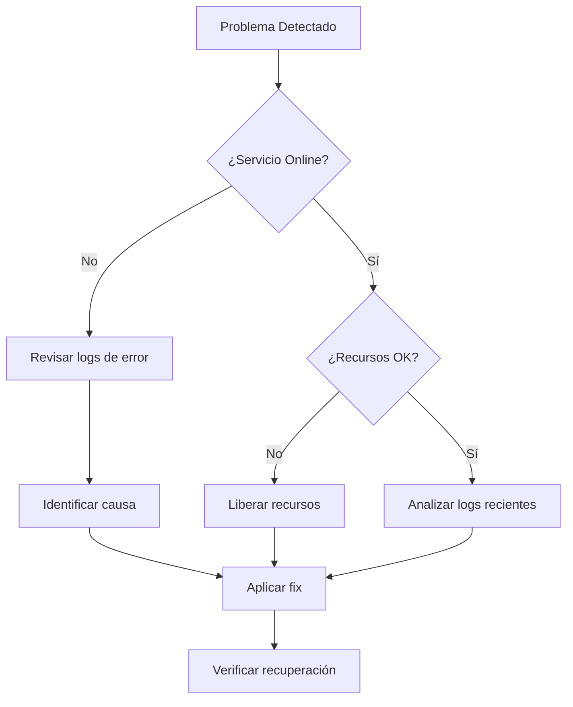

# Monitoreo y Logs

**ID:** DOC-IMP-MON-001
**Versión:** 1.0
**Fecha:** Marzo 2026
**Sistema:** OPENCLAW-system (OpenClaw)

---

## 1. Introducción

Este documento describe el sistema de monitoreo y gestión de logs del OPENCLAW-system, incluyendo métricas clave, herramientas disponibles y procedimientos de troubleshooting.

---

## 2. Sistema de Logs de PM2

### 2.1 Comandos Básicos de Logs

```bash
# Ver logs de todos los servicios
pm2 logs

# Ver logs de un servicio específico
pm2 logs sis-gateway
pm2 logs sis-director
pm2 logs sis-ejecutor
pm2 logs sis-archivador

# Ver últimas N líneas
pm2 logs --lines 100

# Ver solo errores
pm2 logs --err

# Ver solo salida estándar
pm2 logs --out

# Limpiar logs
pm2 flush
```

### 2.2 Ubicación de Archivos de Log

```bash
# Logs de PM2 (por defecto)
~/.pm2/logs/

# Logs del OPENCLAW-system
/root/.openclaw/SIS_CORE/logs/
├── gateway-error.log
├── gateway-out.log
├── director-error.log
├── director-out.log
├── ejecutor-error.log
├── ejecutor-out.log
├── archivador-error.log
└── archivador-out.log
```

### 2.3 Rotación de Logs con PM2

```bash
# Instalar módulo de rotación
pm2 install pm2-logrotate

# Configurar rotación
pm2 set pm2-logrotate:max_size 50M
pm2 set pm2-logrotate:retain 10
pm2 set pm2-logrotate:compress true
pm2 set pm2-logrotate:dateFormat YYYY-MM-DD_HH-mm-ss
```

---

## 3. Niveles de Log

### 3.1 Niveles Disponibles

| Nivel | Valor | Uso |
|-------|-------|-----|
| error | 0 | Errores críticos |
| warn | 1 | Advertencias |
| info | 2 | Información general |
| debug | 3 | Información detallada |
| trace | 4 | Información muy detallada |

### 3.2 Configuración de Nivel de Log

```bash
# Cambiar nivel de log en tiempo de ejecución
export LOG_LEVEL=debug

# O en ecosystem.config.js
env: {
  LOG_LEVEL: 'info'
}
```

### 3.3 Ejemplo de Logs por Nivel

```json
// Log de error
{"level":"error","timestamp":"2026-03-09T10:15:30.000Z","message":"Connection failed","service":"sis-ejecutor","error":"ECONNREFUSED"}

// Log de warning
{"level":"warn","timestamp":"2026-03-09T10:15:31.000Z","message":"Rate limit approaching","service":"sis-ejecutor","current":45,"limit":60}

// Log de info
{"level":"info","timestamp":"2026-03-09T10:15:32.000Z","message":"Message processed","service":"sis-ejecutor","messageId":"abc123","duration":1250}

// Log de debug
{"level":"debug","timestamp":"2026-03-09T10:15:33.000Z","message":"Request details","service":"sis-ejecutor","headers":{},"body":"..."}
```

---

## 4. Logs por Engranaje

### 4.1 Logs del Gateway

```bash
# Ver logs del Gateway
pm2 logs sis-gateway --lines 50

# Filtrar por tipo de evento
grep "connection" /root/.openclaw/SIS_CORE/logs/gateway-out.log
grep "error" /root/.openclaw/SIS_CORE/logs/gateway-error.log
```

**Eventos clave del Gateway:**
- Conexiones entrantes/salientes
- Health checks
- Rate limiting
- Errores de protocolo WebSocket

### 4.2 Logs del Director

```bash
# Ver logs del Director
pm2 logs sis-director --lines 50

# Buscar decisiones de routing
grep "routing" /root/.openclaw/SIS_CORE/logs/director-out.log
```

**Eventos clave del Director:**
- Registro de engranajes
- Decisiones de routing
- Health checks de engranajes
- Balanceo de carga

### 4.3 Logs del Ejecutor

```bash
# Ver logs del Ejecutor
pm2 logs sis-ejecutor --lines 50

# Buscar procesamiento de mensajes
grep "processed" /root/.openclaw/SIS_CORE/logs/ejecutor-out.log
```

**Eventos clave del Ejecutor:**
- Procesamiento de mensajes
- Llamadas a proveedores de IA
- Tiempos de respuesta
- Fallbacks entre proveedores

### 4.4 Logs del Archivador

```bash
# Ver logs del Archivador
pm2 logs sis-archivador --lines 50

# Buscar operaciones de almacenamiento
grep "storage" /root/.openclaw/SIS_CORE/logs/archivador-out.log
```

**Eventos clave del Archivador:**
- Almacenamiento de conversaciones
- Consultas de memoria
- Operaciones de limpieza
- Backup de datos

---

## 5. Métricas Clave a Monitorear

### 5.1 Métricas de Recursos

| Métrica | Comando | Umbral Normal | Alerta |
|---------|---------|---------------|--------|
| CPU | `pm2 monit` | < 50% | > 80% |
| Memoria | `pm2 monit` | < 70% | > 90% |
| Reinicios | `pm2 list` | 0 | > 3/hora |
| Uptime | `pm2 list` | > 1h | < 5min |

### 5.2 Métricas de Aplicación

```bash
#!/bin/bash
# metrics.sh - Recolección de métricas

echo "=== MÉTRICAS OPENCLAW-system ==="

# Memoria por proceso
echo -e "\n[Uso de Memoria]"
pm2 list | grep sis | awk '{printf "%-15s %s\n", $2, $9}'

# CPU por proceso
echo -e "\n[Uso de CPU]"
pm2 list | grep sis | awk '{printf "%-15s %s\n", $2, $8}'

# Latencia (últimas 100 requests)
echo -e "\n[Latencia Promedio]"
grep "duration" /root/.openclaw/SIS_CORE/logs/ejecutor-out.log | tail -100 | \
  jq -s 'add / length | .duration' 2>/dev/null || echo "N/A"

# Tasa de errores (última hora)
echo -e "\n[Tasa de Errores]"
ERRORS=$(grep -c "error" /root/.openclaw/SIS_CORE/logs/*-error.log 2>/dev/null | \
  awk -F: '{sum+=$2} END {print sum}')
TOTAL=$(grep -c "processed" /root/.openclaw/SIS_CORE/logs/ejecutor-out.log 2>/dev/null || echo 0)
if [ "$TOTAL" -gt 0 ]; then
  echo "scale=2; $ERRORS / $TOTAL * 100" | bc | xargs echo "%"
else
  echo "0%"
fi
```

### 5.3 Métricas de Negocio

| Métrica | Descripción | Frecuencia |
|---------|-------------|------------|
| Mensajes procesados/día | Volumen total | Diario |
| Latencia p95 | Percentil 95 de respuesta | Tiempo real |
| Tasa de éxito | % de requests exitosos | Tiempo real |
| Proveedor activo | Proveedor de IA en uso | Tiempo real |

---

## 6. Herramientas de Monitoreo

### 6.1 PM2 Plus (Opcional)

```bash
# Conectar con PM2 Plus
pm2 link <secret_key> <public_key>

# Dashboard web disponible en:
# https://app.pm2.io/
```

**Características:**
- Monitoreo en tiempo real
- Historial de métricas
- Alertas configurables
- Logs centralizados

### 6.2 Prometheus + Grafana (Opcional)

```yaml
# prometheus.yml - Configuración de Prometheus
global:
  scrape_interval: 15s

scrape_configs:
  - job_name: 'openclaw-system'
    static_configs:
      - targets: ['127.0.0.1:9090']
```

```bash
# Exponer métricas de PM2
npm install -g pm2-metrics
pm2-metrics --port 9090
```

### 6.3 Dashboard Custom

```bash
#!/bin/bash
# dashboard.sh - Dashboard simple en terminal

watch -n 5 '
echo "╔════════════════════════════════════════════════════════════╗"
echo "║           OPENCLAW-system Dashboard - $(date +"%H:%M:%S")              ║"
echo "╠════════════════════════════════════════════════════════════╣"
echo "║ SERVICIO          │ STATUS  │ CPU   │ MEM     │ UPTIME    ║"
echo "╠═══════════════════╪═════════╪═══════╪═════════╪═══════════╣"
pm2 list | grep sis | awk "{printf \"║ %-17s │ %-7s │ %-5s │ %-7s │ %-9s ║\n\", \$2, \$10, \$8, \$9, \$11}"
echo "╚════════════════════════════════════════════════════════════╝"

echo ""
echo "RECURSOS DEL SISTEMA:"
free -h | awk "NR==2{printf \"Memoria: %s / %s (Libre: %s)\n\", \$3, \$2, \$7}"
df -h / | awk "NR==2{printf \"Disco:   %s / %s (Libre: %s)\n\", \$3, \$2, \$4}"

echo ""
echo "ÚLTIMOS 5 ERRORES:"
tail -5 /root/.openclaw/SIS_CORE/logs/*-error.log 2>/dev/null | \
  grep -v "^$" | cut -c1-60
'
```

---

## 7. Alertas y Notificaciones

### 7.1 Configuración de Alertas

```bash
#!/bin/bash
# alert-monitor.sh - Monitor con alertas

ALERT_CHAT_ID="tu_chat_id"
BOT_TOKEN="${TELEGRAM_BOT_TOKEN}"

send_alert() {
  local message="$1"
  curl -s "https://api.telegram.org/bot${BOT_TOKEN}/sendMessage" \
    -d "chat_id=${ALERT_CHAT_ID}" \
    -d "text=🚨 ALERTA OPENCLAW-system\n\n${message}"
}

# Verificar memoria
check_memory() {
  MEM_USAGE=$(free | awk '/Mem/{printf("%.0f"), $3/$2*100}')
  if [ $MEM_USAGE -gt 90 ]; then
    send_alert "Memoria crítica: ${MEM_USAGE}%"
  fi
}

# Verificar servicios
check_services() {
  DOWN_SERVICES=$(pm2 list | grep sis | grep -v "online" | awk '{print $2}')
  if [ ! -z "$DOWN_SERVICES" ]; then
    send_alert "Servicios caidos: ${DOWN_SERVICES}"
  fi
}

# Verificar tasa de errores
check_errors() {
  RECENT_ERRORS=$(find /root/.openclaw/SIS_CORE/logs -name "*error.log" -mmin -5 -exec cat {} \; | wc -l)
  if [ $RECENT_ERRORS -gt 10 ]; then
    send_alert "Alta tasa de errores: ${RECENT_ERRORS} en últimos 5 min"
  fi
}

# Ejecutar checks
check_memory
check_services
check_errors
```

### 7.2 Umbrales de Alerta

| Métrica | Warning | Critical | Acción |
|---------|---------|----------|--------|
| CPU | > 70% | > 90% | Investigar/Escalar |
| Memoria | > 80% | > 95% | Reiniciar/Escalar |
| Errores/min | > 5 | > 20 | Investigar/Rollback |
| Latencia p95 | > 5s | > 10s | Investigar |

---

## 8. Análisis de Logs y Troubleshooting

### 8.1 Consultas Útiles

```bash
# Buscar errores en todas las logs
grep -r "error" /root/.openclaw/SIS_CORE/logs/

# Contar errores por servicio
for log in /root/.openclaw/SIS_CORE/logs/*-error.log; do
  echo "$(basename $log): $(wc -l < $log) errores"
done

# Ver logs de un período específico
grep "2026-03-09T10:" /root/.openclaw/SIS_CORE/logs/ejecutor-out.log

# Buscar mensajes lentos (>3 segundos)
grep "duration" /root/.openclaw/SIS_CORE/logs/ejecutor-out.log | \
  jq 'select(.duration > 3000)'

# Top 10 errores más frecuentes
grep "error" /root/.openclaw/SIS_CORE/logs/*-error.log | \
  jq -r '.message' | sort | uniq -c | sort -rn | head -10
```

### 8.2 Problemas Comunes y Soluciones

#### Error: "Connection refused" al Gateway

```bash
# Síntoma: Los engranajes no pueden conectar al Gateway

# Diagnóstico
netstat -tlnp | grep 18789
pm2 logs sis-gateway --lines 20

# Solución
pm2 restart sis-gateway
sleep 5
pm2 restart sis-director sis-ejecutor sis-archivador
```

#### Error: "Out of memory"

```bash
# Síntoma: Servicio reiniciado por falta de memoria

# Diagnóstico
pm2 describe sis-ejecutor | grep memory

# Solución temporal
pm2 restart sis-ejecutor

# Solución permanente: Aumentar límite en ecosystem.config.js
max_memory_restart: '3G'
```

#### Error: Timeout en proveedor de IA

```bash
# Síntoma: Requests timeout a OpenAI/z.ai

# Diagnóstico
grep "timeout" /root/.openclaw/SIS_CORE/logs/ejecutor-error.log

# Solución: Verificar fallback
# El Ejecutor debería usar el siguiente proveedor automáticamente
grep "fallback" /root/.openclaw/SIS_CORE/logs/ejecutor-out.log
```

### 8.3 Procedimiento de Diagnóstico



---

## 9. Retención y Archivado de Logs

### 9.1 Política de Retención

| Tipo de Log | Retención | Compresión |
|-------------|-----------|------------|
| Error logs | 30 días | Sí (después de 7 días) |
| Access logs | 7 días | Sí (después de 3 días) |
| Debug logs | 3 días | No |

### 9.2 Script de Limpieza

```bash
#!/bin/bash
# cleanup-logs.sh - Limpieza de logs antiguos

LOG_DIR="/root/.openclaw/SIS_CORE/logs"

# Comprimir logs de error mayores a 7 días
find $LOG_DIR -name "*error.log" -mtime +7 -exec gzip {} \;

# Eliminar logs comprimidos mayores a 30 días
find $LOG_DIR -name "*.gz" -mtime +30 -delete

# Eliminar logs debug mayores a 3 días
find $LOG_DIR -name "*debug*" -mtime +3 -delete

echo "Limpieza de logs completada: $(date)"
```

---

## 10. Próximos Pasos

Continuar con:
- [05-mantenimiento.md](./05-mantenimiento.md) - Mantenimiento y Upgrades
- [06-failover.md](./06-failover.md) - Failover y Recuperación

---

| Fecha | Versión | Cambio |
|-------|---------|--------|
| 2026-03-09 | 1.0 | Documento inicial |

*Documento generado para OPENCLAW-system v1.0 - OPENCLAW-system*
