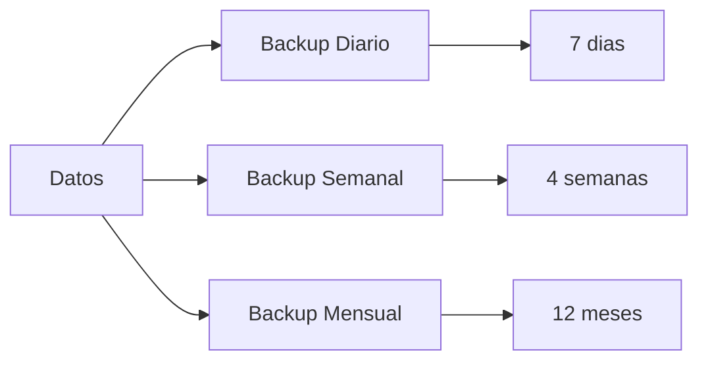

# Mantenimiento y Upgrades

**ID:** DOC-IMP-MAN-001
**Versión:** 1.0
**Fecha:** Marzo 2026
**Sistema:** OPENCLAW-system (OpenClaw)

---

## 1. Introducción

Este documento describe las rutinas de mantenimiento del OPENCLAW-system, procedimientos de actualización y estrategias para upgrades sin downtime.

---

## 2. Rutinas de Mantenimiento Diarias

### 2.1 Script de Mantenimiento Diario

```bash
#!/bin/bash
# daily-maintenance.sh - Mantenimiento diario

LOG_FILE="/root/.openclaw/SIS_CORE/logs/maintenance.log"

log() {
  echo "[$(date '+%Y-%m-%d %H:%M:%S')] $1" >> $LOG_FILE
}

log "=== INICIO MANTENIMIENTO DIARIO ==="

# 1. Verificar estado de servicios
log "Verificando servicios..."
SERVICES_DOWN=$(pm2 list | grep sis | grep -v "online" | wc -l)
if [ $SERVICES_DOWN -gt 0 ]; then
  log "ALERTA: $SERVICES_DOWN servicios no estan online"
  pm2 restart all
fi

# 2. Verificar espacio en disco
log "Verificando espacio en disco..."
DISK_USAGE=$(df -h / | awk 'NR==2 {print $5}' | tr -d '%')
if [ $DISK_USAGE -gt 80 ]; then
  log "WARNING: Uso de disco al ${DISK_USAGE}%"
fi

# 3. Limpiar archivos temporales antiguos
log "Limpiando archivos temporales..."
find /root/.openclaw/SIS_CORE/tmp -type f -mtime +1 -delete 2>/dev/null

# 4. Comprimir logs del dia anterior
log "Comprimiendo logs antiguos..."
find /root/.openclaw/SIS_CORE/logs -name "*.log" -mtime +1 -exec gzip {} \; 2>/dev/null

# 5. Verificar integridad de base de datos
log "Verificando integridad de SQLite..."
DB_PATH="/root/.openclaw/SIS_CORE/data/memory/conversations.db"
if [ -f "$DB_PATH" ]; then
  sqlite3 $DB_PATH "PRAGMA integrity_check;" | grep -q "ok" && log "DB OK" || log "ERROR: DB corrupta"
fi

# 6. Backup de configuracion
log "Realizando backup de configuracion..."
BACKUP_DIR="/root/.openclaw/backups/daily/$(date +%Y%m%d)"
mkdir -p $BACKUP_DIR
cp -r /root/.openclaw/SIS_CORE/config $BACKUP_DIR/

# 7. Reportar estado
log "Reportando estado..."
TOTAL_MEMORY=$(free -m | awk '/Mem:/{print $2}')
USED_MEMORY=$(free -m | awk '/Mem:/{print $3}')
log "Memoria: ${USED_MEMORY}MB / ${TOTAL_MEMORY}MB"

log "=== FIN MANTENIMIENTO DIARIO ==="
```

### 2.2 Cron Job Diario

```bash
# Agregar a crontab: crontab -e
# Ejecutar a las 3:00 AM
0 3 * * * /root/scripts/daily-maintenance.sh
```

### 2.3 Checklist Diario Manual

| Tarea | Comando | Frecuencia |
|-------|---------|------------|
| Verificar servicios | `pm2 list` | Diario |
| Revisar errores | `pm2 logs --err --lines 50` | Diario |
| Verificar memoria | `free -h` | Diario |
| Verificar disco | `df -h` | Diario |

---

## 3. Rutinas de Mantenimiento Semanales

### 3.1 Script de Mantenimiento Semanal

```bash
#!/bin/bash
# weekly-maintenance.sh - Mantenimiento semanal

LOG_FILE="/root/.openclaw/SIS_CORE/logs/maintenance.log"

log() {
  echo "[$(date '+%Y-%m-%d %H:%M:%S')] $1" >> $LOG_FILE
}

log "=== INICIO MANTENIMIENTO SEMANAL ==="

# 1. Actualizar estadisticas de SQLite
log "Actualizando estadisticas de SQLite..."
DB_PATH="/root/.openclaw/SIS_CORE/data/memory/conversations.db"
sqlite3 $DB_PATH "ANALYZE;"

# 2. Vacuum de base de datos
log "Ejecutando VACUUM..."
sqlite3 $DB_PATH "VACUUM;" 2>/dev/null && log "VACUUM completado"

# 3. Limpiar conversaciones antiguas (mas de 30 dias)
log "Limpiando conversaciones antiguas..."
sqlite3 $DB_PATH "DELETE FROM conversations WHERE created_at < datetime('now', '-30 days');"

# 4. Backup completo semanal
log "Realizando backup semanal..."
BACKUP_DIR="/root/.openclaw/backups/weekly/$(date +%Y%m%d)"
mkdir -p $BACKUP_DIR
cp -r /root/.openclaw/SIS_CORE/data $BACKUP_DIR/
cp -r /root/.openclaw/SIS_CORE/config $BACKUP_DIR/
tar -czf ${BACKUP_DIR}.tar.gz -C $(dirname $BACKUP_DIR) $(basename $BACKUP_DIR)
rm -rf $BACKUP_DIR

# 5. Eliminar backups semanales mayores a 4 semanas
find /root/.openclaw/backups/weekly -name "*.tar.gz" -mtime +28 -delete

# 6. Verificar actualizaciones de seguridad
log "Verificando actualizaciones de seguridad..."
apt update -qq
SECURITY_UPDATES=$(apt list --upgradable 2>/dev/null | grep -i security | wc -l)
if [ $SECURITY_UPDATES -gt 0 ]; then
  log "ALERTA: $SECURITY_UPDATES actualizaciones de seguridad pendientes"
fi

# 7. Rolling restart para liberar memoria fragmentada
log "Ejecutando rolling restart..."
pm2 restart sis-gateway && sleep 10
pm2 restart sis-director && sleep 5
pm2 restart sis-ejecutor && sleep 5
pm2 restart sis-archivador

log "=== FIN MANTENIMIENTO SEMANAL ==="
```

### 3.2 Cron Job Semanal

```bash
# Ejecutar cada domingo a las 4:00 AM
0 4 * * 0 /root/scripts/weekly-maintenance.sh
```

---

## 4. Rutinas de Mantenimiento Mensuales

### 4.1 Script de Mantenimiento Mensual

```bash
#!/bin/bash
# monthly-maintenance.sh - Mantenimiento mensual

LOG_FILE="/root/.openclaw/SIS_CORE/logs/maintenance.log"

log() {
  echo "[$(date '+%Y-%m-%d %H:%M:%S')] $1" >> $LOG_FILE
}

log "=== INICIO MANTENIMIENTO MENSUAL ==="

# 1. Auditoria de logs
log "Generando reporte mensual..."
ERRORS=$(find /root/.openclaw/SIS_CORE/logs -name "*error.log*" -mtime -30 -exec zcat {} \; 2>/dev/null | wc -l)
MESSAGES=$(grep -c "processed" /root/.openclaw/SIS_CORE/logs/ejecutor-out.log 2>/dev/null || echo 0)

log "Estadisticas del mes:"
log "  - Mensajes procesados: $MESSAGES"
log "  - Errores: $ERRORS"

# 2. Verificar dependencias desactualizadas
log "Verificando dependencias..."
cd /home/openclaw/projects/openclaw
OUTDATED=$(pnpm outdated 2>/dev/null | wc -l)
if [ $OUTDATED -gt 0 ]; then
  log "ALERTA: $OUTDATED dependencias desactualizadas"
fi

# 3. Backup mensual completo
log "Realizando backup mensual completo..."
BACKUP_DIR="/root/.openclaw/backups/monthly/$(date +%Y%m)"
mkdir -p $BACKUP_DIR
cp -r /root/.openclaw/SIS_CORE $BACKUP_DIR/
tar -czf ${BACKUP_DIR}.tar.gz -C $(dirname $BACKUP_DIR) $(basename $BACKUP_DIR)
rm -rf $BACKUP_DIR

# 4. Eliminar backups mensuales mayores a 12 meses
find /root/.openclaw/backups/monthly -name "*.tar.gz" -mtime +365 -delete

# 5. Generar reporte de capacidad
log "Generando reporte de capacidad..."
{
  echo "=== REPORTE MENSUAL - $(date '+%Y-%m') ==="
  echo "SERVIDOR:"
  free -h | awk 'NR==2{print "  Memoria: " $3 " usada de " $2}'
  df -h / | awk 'NR==2{print "  Disco: " $3 " usado de " $2}'
  echo "SERVICIOS:"
  pm2 list | grep sis
} > /root/.openclaw/reports/monthly-$(date +%Y%m).txt

log "=== FIN MANTENIMIENTO MENSUAL ==="
```

### 4.2 Cron Job Mensual

```bash
# Ejecutar el primer dia de cada mes a las 2:00 AM
0 2 1 * * /root/scripts/monthly-maintenance.sh
```

---

## 5. Actualizacion de Dependencias

### 5.1 Actualizar Dependencias npm

```bash
#!/bin/bash
# update-dependencies.sh

set -e
cd /home/openclaw/projects/openclaw

echo "=== ACTUALIZACION DE DEPENDENCIAS ==="

# Backup
cp package.json package.json.backup
cp pnpm-lock.yaml pnpm-lock.yaml.backup

# Verificar actualizaciones
echo "Verificando actualizaciones..."
pnpm outdated

# Actualizar
echo "Actualizando dependencias..."
pnpm update

# Reconstruir
echo "Reconstruyendo..."
node scripts/tsdown-build.mjs

echo "=== ACTUALIZACION COMPLETADA ==="
```

### 5.2 Verificar Vulnerabilidades

```bash
# Verificar vulnerabilidades
pnpm audit

# Corregir automaticamente
pnpm audit --fix
```

---

## 6. Actualizacion de OpenClaw

### 6.1 Script de Upgrade

```bash
#!/bin/bash
# upgrade-openclaw.sh

set -e
VERSION="${1:-main}"

echo "=== UPGRADE OPENCLAW A ${VERSION} ==="

cd /home/openclaw/projects/openclaw

# 1. Backup
echo "[1/8] Creando backup..."
BACKUP_DIR="/root/.openclaw/backups/pre-upgrade/$(date +%Y%m%d_%H%M%S)"
mkdir -p $BACKUP_DIR
cp -r dist $BACKUP_DIR/ 2>/dev/null || true

# 2. Detener servicios
echo "[2/8] Deteniendo servicios..."
pm2 stop all

# 3. Guardar version actual
echo "[3/8] Guardando version actual..."
CURRENT_VERSION=$(git rev-parse HEAD)

# 4. Obtener nueva version
echo "[4/8] Descargando ${VERSION}..."
git fetch --all
git stash
git checkout $VERSION

# 5. Actualizar dependencias
echo "[5/8] Actualizando dependencias..."
pnpm install --frozen-lockfile

# 6. Build
echo "[6/8] Construyendo..."
node scripts/tsdown-build.mjs

# 7. Verificar build
echo "[7/8] Verificando build..."
if [ ! -f "dist/cli/openclaw.js" ]; then
  echo "ERROR: Build fallido, revirtiendo..."
  git checkout $CURRENT_VERSION
  pnpm install --frozen-lockfile
  node scripts/tsdown-build.mjs
  pm2 restart all
  exit 1
fi

# 8. Reiniciar
echo "[8/8] Reiniciando servicios..."
pm2 restart all

sleep 10
pm2 list

echo "=== UPGRADE COMPLETADO ==="
```

---

## 7. Backup y Restore

### 7.1 Estrategia de Backup



### 7.2 Script de Backup

```bash
#!/bin/bash
# backup.sh

BACKUP_TYPE="${1:-daily}"
BACKUP_DIR="/root/.openclaw/backups/${BACKUP_TYPE}/$(date +%Y%m%d_%H%M%S)"

echo "=== BACKUP ${BACKUP_TYPE^^} ==="

mkdir -p $BACKUP_DIR

# Backup configuracion y datos
cp -r /root/.openclaw/SIS_CORE/config $BACKUP_DIR/
cp -r /root/.openclaw/SIS_CORE/data $BACKUP_DIR/

# Comprimir
tar -czf ${BACKUP_DIR}.tar.gz -C $(dirname $BACKUP_DIR) $(basename $BACKUP_DIR)
rm -rf $BACKUP_DIR

SIZE=$(du -h ${BACKUP_DIR}.tar.gz | awk '{print $1}')
echo "Backup completado: ${BACKUP_DIR}.tar.gz (${SIZE})"
```

### 7.3 Script de Restore

```bash
#!/bin/bash
# restore.sh

BACKUP_FILE="$1"

if [ -z "$BACKUP_FILE" ]; then
  echo "Uso: $0 <archivo_backup.tar.gz>"
  echo "Backups disponibles:"
  find /root/.openclaw/backups -name "*.tar.gz" -mtime -30 | sort -r
  exit 1
fi

echo "=== RESTORE DESDE $BACKUP_FILE ==="

# Detener servicios
pm2 stop all

# Extraer y restaurar
TEMP_DIR=$(mktemp -d)
tar -xzf $BACKUP_FILE -C $TEMP_DIR
BACKUP_CONTENT=$(ls $TEMP_DIR)

# Restaurar datos
cp -r $TEMP_DIR/$BACKUP_CONTENT/config/* /root/.openclaw/SIS_CORE/config/
cp -r $TEMP_DIR/$BACKUP_CONTENT/data/* /root/.openclaw/SIS_CORE/data/

rm -rf $TEMP_DIR

# Reiniciar
pm2 restart all

echo "=== RESTORE COMPLETADO ==="
```

---

## 8. Gestion de Parches de Seguridad

### 8.1 Verificacion de Seguridad

```bash
#!/bin/bash
# security-check.sh

echo "=== VERIFICACION DE SEGURIDAD ==="

# Actualizaciones de seguridad del SO
echo "Actualizaciones de seguridad pendientes:"
apt update -qq
apt list --upgradable 2>/dev/null | grep -i security

# Vulnerabilidades npm
echo "Vulnerabilidades en dependencias:"
cd /home/openclaw/projects/openclaw
pnpm audit --audit-level=high

# Verificar permisos
echo "Verificando permisos..."
find /root/.openclaw/SIS_CORE/config -type f -exec ls -la {} \; | grep -v "rw-------\|rw-r-----"

echo "=== VERIFICACION COMPLETADA ==="
```

---

## 9. Plan de Rollback

### 9.1 Criterios para Rollback

| Criterio | Umbral | Accion |
|----------|--------|--------|
| Tasa de error | > 5% | Rollback inmediato |
| Latencia p95 | > 10s | Investigar |
| Servicio caido | > 3 min | Rollback si no recupera |
| Memoria agotada | > 90% | Reinicio + investigar |

### 9.2 Ejecucion de Rollback

```bash
# Rollback rapido a version anterior
cd /home/openclaw/projects/openclaw
git checkout HEAD~1
pnpm install --frozen-lockfile
node scripts/tsdown-build.mjs
pm2 restart all
```

---

## 10. Checklist de Mantenimiento

| Frecuencia | Tareas |
|------------|--------|
| Diario | Verificar servicios, revisar logs, verificar recursos |
| Semanal | Vacuum DB, backup completo, rolling restart |
| Mensual | Auditoria, reporte, verificar dependencias |
| Trimestral | Rotacion de API keys, auditoria de seguridad |

---

## 11. Próximos Pasos

Continuar con:
- [06-failover.md](./06-failover.md) - Failover y Recuperación

---

| Fecha | Versión | Cambio |
|-------|---------|--------|
| 2026-03-09 | 1.0 | Documento inicial |

*Documento generado para OPENCLAW-system v1.0 - OPENCLAW-system*
