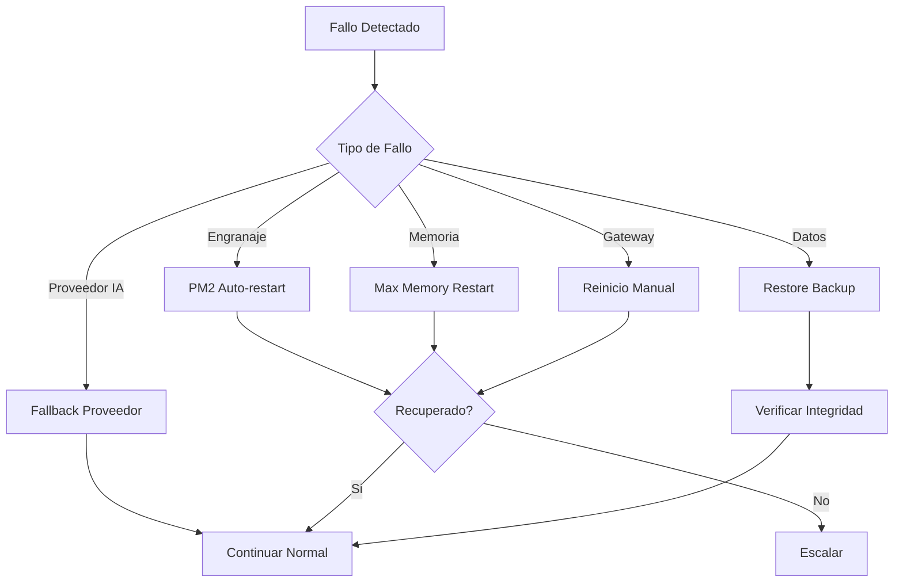
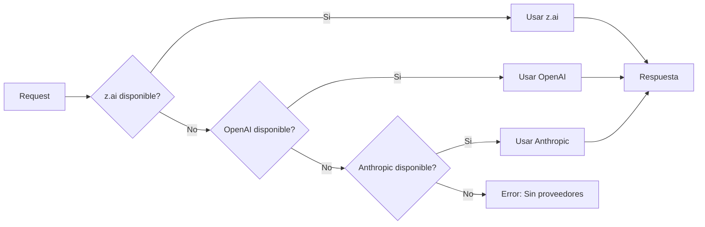

# Failover y Recuperación

**ID:** DOC-IMP-FAI-001
**Versión:** 1.0
**Fecha:** Marzo 2026
**Sistema:** OPENCLAW-system (OpenClaw)

---

## 1. Introducción

Este documento describe los escenarios de fallo del OPENCLAW-system, las estrategias de failover automáticas y manuales, y los procedimientos de recuperación ante desastres.

---

## 2. Escenarios de Fallo Comunes

### 2.1 Clasificación de Fallos

| Tipo | Severidad | Detección | Recuperación |
|------|-----------|-----------|--------------|
| Crash de engranaje | Media | PM2 health check | Automática |
| Agotamiento de memoria | Alta | PM2 memory limit | Automática |
| Cuello de botella CPU | Media | Monitoreo | Manual |
| Falla de Gateway | Crítica | Health check | Automática/Manual |
| Fallo de proveedor IA | Baja | Timeout | Automática (fallback) |
| Corrupción de datos | Crítica | Integrity check | Manual |

### 2.2 Diagrama de Escenarios



---

## 3. Crash de un Engranaje

### 3.1 Síntomas

- Proceso terminado inesperadamente
- PM2 muestra status "errored" o "stopped"
- Logs con stack trace o "SIGKILL"

### 3.2 Detección Automática

```bash
# PM2 detecta y reinicia automáticamente
# Configuración en ecosystem.config.js:
autorestart: true,
max_restarts: 10,
restart_window: 60000,  # 1 minuto
exp_backoff_restart_delay: 100
```

### 3.3 Diagnóstico Manual

```bash
# Verificar estado
pm2 list

# Ver logs del error
pm2 logs sis-ejecutor --err --lines 100

# Ver detalles del proceso
pm2 describe sis-ejecutor

# Verificar memoria en el momento del crash
dmesg | grep -i "killed process"
```

### 3.4 Recuperación Manual

```bash
# Reiniciar servicio específico
pm2 restart sis-ejecutor

# Si no funciona, reinicio completo
pm2 restart all

# Verificar después del reinicio
pm2 list
pm2 logs --lines 20
```

---

## 4. Agotamiento de Memoria

### 4.1 Síntomas

- Proceso reiniciado frecuentemente
- Logs con "JavaScript heap out of memory"
- Sistema lento o no responsivo

### 4.2 Configuración Preventiva

```javascript
// ecosystem.config.js
{
  name: 'sis-ejecutor',
  max_memory_restart: '2G',  // Reiniciar antes de agotar
  node_args: '--max-old-space-size=1800'  // Limite de V8
}
```

### 4.3 Diagnóstico

```bash
# Ver uso de memoria actual
pm2 list

# Ver memoria detallada
pm2 describe sis-ejecutor | grep memory

# Ver memoria del sistema
free -h

# Identificar proceso con más memoria
ps aux --sort=-%mem | head -10
```

### 4.4 Recuperación

```bash
# Liberar memoria caché del sistema
sync && echo 3 | sudo tee /proc/sys/vm/drop_caches

# Reiniciar servicios en orden
pm2 restart sis-gateway && sleep 5
pm2 restart sis-director && sleep 3
pm2 restart sis-ejecutor && sleep 3
pm2 restart sis-archivador

# Si el problema persiste, aumentar max_memory_restart
# Editar ecosystem.config.js y recargar
pm2 reload ecosystem.config.js
```

---

## 5. Cuello de Botella en CPU

### 5.1 Síntomas

- Latencia alta en respuestas
- Timeouts frecuentes
- CPU al 100% sostenido

### 5.2 Diagnóstico

```bash
# Ver uso de CPU en tiempo real
pm2 monit

# Ver procesos por CPU
top -p $(pgrep -d',' -f openclaw)

# Ver historial de CPU
pm2 list  # columna "cpu"
```

### 5.3 Mitigación

```bash
# Reducir carga temporalmente
pm2 stop sis-ejecutor
sleep 30
pm2 start sis-ejecutor

# Escalar Ejecutor si es necesario
pm2 scale sis-ejecutor 2

# Ajustar concurrencia en configuracion
# Editar gears/ejecutor.json:
# "processing": { "maxConcurrent": 5 }  # Reducir de 10
```

---

## 6. Falla de Comunicación Gateway

### 6.1 Síntomas

- Engranajes no pueden conectar
- Error "ECONNREFUSED" en logs
- Mensajes no procesados

### 6.2 Diagnóstico

```bash
# Verificar puerto del Gateway
netstat -tlnp | grep 18789

# Verificar proceso Gateway
pm2 describe sis-gateway

# Test de conectividad
curl -v http://127.0.0.1:18789/health

# Ver logs del Gateway
pm2 logs sis-gateway --lines 50
```

### 6.3 Recuperación

```bash
# Reiniciar Gateway primero
pm2 restart sis-gateway

# Esperar a que esté listo
sleep 10

# Verificar health
curl http://127.0.0.1:18789/health

# Reiniciar engranajes para reconectar
pm2 restart sis-director sis-ejecutor sis-archivador
```

### 6.4 Diagrama de Recuperacion Gateway

```mermaid
sequenceDiagram
    participant G as Gateway
    participant D as Director
    participant E as Ejecutor
    participant A as Archivador

    Note over G: Gateway falla
    D->>G: Connection refused
    E->>G: Connection refused
    A->>G: Connection refused

    Note over G: Reinicio Gateway
    G->>G: pm2 restart sis-gateway
    G->>G: Esperar 10s

    Note over D,E,A: Reconexion
    D->>G: Reconnect
    E->>G: Reconnect
    A->>G: Reconnect

    Note over G,A: Sistema restaurado
```

---

## 7. Fallo de Proveedor de IA

### 7.1 Síntomas

- Timeouts en llamadas a API
- Error 429 (Rate limit)
- Error 500/502/503 del proveedor

### 7.2 Fallback Automatico

```json
// providers.json
{
  "fallback": {
    "strategy": "sequential",
    "order": ["zai", "openai", "anthropic"],
    "maxAttempts": 3
  }
}
```

### 7.3 Diagnóstico

```bash
# Ver logs de llamadas a proveedores
grep "provider" /root/.openclaw/SIS_CORE/logs/ejecutor-out.log

# Ver fallbacks activados
grep "fallback" /root/.openclaw/SIS_CORE/logs/ejecutor-out.log

# Test de conectividad con proveedores
curl -I https://api.openai.com/v1/models
curl -I https://open.bigmodel.cn/api/paas/v4/models
```

### 7.4 Recuperacion Manual

```bash
# Si un proveedor esta caido, deshabilitar temporalmente
# Editar providers.json:
# "zai": { "enabled": false }

# Reiniciar Ejecutor para aplicar cambios
pm2 restart sis-ejecutor
```

---

## 8. Estrategias de Failover Automáticas

### 8.1 PM2 Auto-restart con Backoff

```javascript
// ecosystem.config.js
{
  autorestart: true,
  restart_delay: 4000,           // 4s entre intentos
  exp_backoff_restart_delay: 100, // Backoff exponencial
  max_restarts: 10,               // Max 10 reinicios/minuto
  restart_window: 60000,
  kill_timeout: 5000,
  wait_ready: true
}
```

### 8.2 Fallback entre Proveedores



### 8.3 Reintentos con Backoff Exponencial

```javascript
// Configuracion en ejecutor.json
{
  "processing": {
    "retryAttempts": 3,
    "retryDelay": 1000,
    "retryBackoff": "exponential"
  }
}

// Comportamiento:
// Intento 1: esperar 1s
// Intento 2: esperar 2s
// Intento 3: esperar 4s
```

---

## 9. Procedimientos Manuales de Recuperación

### 9.1 Reinicio Manual de Servicios

```bash
#!/bin/bash
# manual-restart.sh - Reinicio manual ordenado

echo "=== REINICIO MANUAL ==="

# Detener todos
pm2 stop all

# Limpiar estado
pm2 delete all

# Reiniciar en orden
pm2 start ecosystem.config.js --only sis-gateway
sleep 10

pm2 start ecosystem.config.js --only sis-director
sleep 5

pm2 start ecosystem.config.js --only sis-ejecutor
sleep 5

pm2 start ecosystem.config.js --only sis-archivador

# Verificar
pm2 list
pm2 save

echo "=== REINICIO COMPLETADO ==="
```

### 9.2 Restauración desde Backup

```bash
#!/bin/bash
# restore-backup.sh

BACKUP_FILE="$1"

if [ -z "$BACKUP_FILE" ]; then
  echo "Especificar archivo de backup"
  find /root/.openclaw/backups -name "*.tar.gz" | sort -r | head -5
  exit 1
fi

# Detener servicios
pm2 stop all

# Backup actual
cp -r /root/.openclaw/SIS_CORE/data /root/.openclaw/SIS_CORE/data.bak

# Restaurar
TEMP_DIR=$(mktemp -d)
tar -xzf $BACKUP_FILE -C $TEMP_DIR
cp -r $TEMP_DIR/*/data/* /root/.openclaw/SIS_CORE/data/
rm -rf $TEMP_DIR

# Reiniciar
pm2 restart all

echo "Restore completado"
```

### 9.3 Reset de Engranajes Individuales

```bash
# Reset solo del Ejecutor
pm2 stop sis-ejecutor
rm -f /root/.openclaw/SIS_CORE/data/memory/ejecutor-cache*
pm2 start sis-ejecutor

# Reset solo del Archivador (cuidado: pierde memoria)
pm2 stop sis-archivador
pm2 start sis-archivador
```

---

## 10. Testing de Failover (Chaos Engineering)

### 10.1 Test de Auto-restart

```bash
#!/bin/bash
# test-auto-restart.sh

echo "=== TEST AUTO-RESTART ==="

# Obtener PID actual
OLD_PID=$(pm2 describe sis-ejecutor | grep "pid" | awk '{print $4}')
echo "PID original: $OLD_PID"

# Matar proceso
kill -9 $OLD_PID

# Esperar recuperación
sleep 15

# Verificar nuevo PID
NEW_PID=$(pm2 describe sis-ejecutor | grep "pid" | awk '{print $4}')
STATUS=$(pm2 describe sis-ejecutor | grep "status" | awk '{print $4}')

echo "PID nuevo: $NEW_PID"
echo "Status: $STATUS"

if [ "$STATUS" = "online" ] && [ "$OLD_PID" != "$NEW_PID" ]; then
  echo "✅ Test PASADO: Auto-restart funciona"
else
  echo "❌ Test FALLIDO"
fi
```

### 10.2 Test de Fallback de Proveedores

```bash
#!/bin/bash
# test-provider-fallback.sh

echo "=== TEST FALLBACK PROVEEDORES ==="

# Simular fallo de z.ai (cambiar API key temporalmente)
OLD_KEY=$ZHIPUAI_API_KEY
export ZHIPUAI_API_KEY="invalid_key"

# Enviar mensaje de prueba
echo "Test message" | timeout 30 openclaw chat --channel cli

if [ $? -eq 0 ]; then
  echo "✅ Test PASADO: Fallback funciona"
else
  echo "❌ Test FALLIDO: Fallback no funciona"
fi

# Restaurar API key
export ZHIPUAI_API_KEY=$OLD_KEY
```

### 10.3 Test de Memoria

```bash
#!/bin/bash
# test-memory-limit.sh

echo "=== TEST LIMITE MEMORIA ==="

# Verificar límite configurado
LIMIT=$(pm2 describe sis-ejecutor | grep "max_memory_restart" | awk '{print $4}')
echo "Límite configurado: $LIMIT"

# Monitorear uso
pm2 monit &
MONIT_PID=$!

# Generar carga (simular muchas requests)
for i in {1..100}; do
  echo "Test message $i" | openclaw chat --channel cli &
done
wait

sleep 30
kill $MONIT_PID 2>/dev/null

# Verificar que el servicio sigue online
STATUS=$(pm2 describe sis-ejecutor | grep "status" | awk '{print $4}')
RESTARTS=$(pm2 describe sis-ejecutor | grep "restarts" | awk '{print $4}')

echo "Status: $STATUS"
echo "Reinicios: $RESTARTS"

if [ "$STATUS" = "online" ]; then
  echo "✅ Test PASADO"
else
  echo "❌ Test FALLIDO"
fi
```

---

## 11. Documentación de Incidentes (Post-Mortem)

### 11.1 Template de Post-Mortem

```markdown
# Post-Mortem: [Título del Incidente]

**Fecha:** YYYY-MM-DD
**Duración:** X horas Y minutos
**Severidad:** Critical/High/Medium/Low
**Autor:** [Nombre]

## Resumen Ejecutivo
[Breve descripción del incidente]

## Timeline
- HH:MM - Detección del problema
- HH:MM - Primer diagnóstico
- HH:MM - Acción correctiva aplicada
- HH:MM - Servicio restaurado

## Causa Raíz
[Análisis de la causa raíz]

## Impacto
- Usuarios afectados: X
- Mensajes perdidos: X
- Tiempo de inactividad: X min

## Acciones Correctivas
1. [Acción inmediata]
2. [Acción preventiva]
3. [Mejora de monitoreo]

## Lecciones Aprendidas
- [Lección 1]
- [Lección 2]

## Métricas
- MTTR: X minutos
- Tiempo hasta detección: X minutos
```

### 11.2 Métricas de Resiliencia

| Métrica | Descripción | Objetivo |
|---------|-------------|----------|
| MTTR | Mean Time To Recovery | < 15 min |
| MTBF | Mean Time Between Failures | > 720h (30 días) |
| Uptime | Disponibilidad del sistema | > 99.9% |
| RTO | Recovery Time Objective | < 1 hora |
| RPO | Recovery Point Objective | < 1 hora |

---

## 12. Contactos de Emergencia

| Rol | Responsable | Contacto |
|-----|-------------|----------|
| On-call Primario | [Nombre] | [Teléfono/Telegram] |
| On-call Secundario | [Nombre] | [Teléfono/Telegram] |
| Tech Lead | [Nombre] | [Teléfono/Telegram] |

---

## 13. Próximos Pasos

Volver a:
- [00-plan-general.md](./00-plan-general.md) - Plan General de Implementación

---

| Fecha | Versión | Cambio |
|-------|---------|--------|
| 2026-03-09 | 1.0 | Documento inicial |

*Documento generado para OPENCLAW-system v1.0 - OPENCLAW-system*
