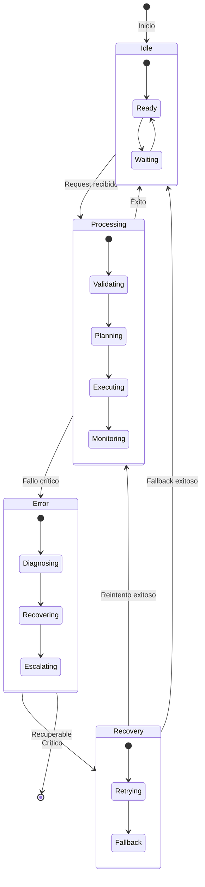

# Ciclo de Vida de Agentes

**ID:** DOC-DES-CIC-001
**Versión:** OPENCLAW-system v1.0
**Fecha:** 2026-03-09
**Estado:** Documentación Técnica

---

## 1. Visión General

El OPENCLAW-system implementa una arquitectura **Triunvirato** compuesta por tres tipos de agentes especializados que trabajan en conjunto siguiendo el patrón **R-P-V** (Request-Process-Validate).

### 1.1 Diagrama de Estados General



### 1.2 Estados Comunes

| Estado | Descripción |
|--------|-------------|
| **Idle** | Agente inactivo, esperando trabajo |
| **Processing** | Procesando tarea activa |
| **Error** | Error encontrado, diagnosticando |
| **Recovery** | Intentando recuperación |

---

## 2. Ciclo de Vida del Director

### 2.1 Rol

El **Director** es el orquestador principal del Triunvirato.

**Responsabilidades:**
- Recibir y parsear requests del usuario
- Tomar decisiones de alto nivel
- Delegar tareas al Ejecutor apropiado
- Validar respuestas antes de entregar
- Gestionar auditoría con el Archivador

### 2.2 Flujo de Estados

```
INIT → LOADING → LISTENING → PROCESSING → DELEGATING → VALIDATING → RESPONDING
                      ↓              ↓
                   ERROR ←──────────┘
                      ↓
                   RECOVERY
```

### 2.3 Inicializacion

```typescript
// director/lifecycle.ts
interface DirectorState {
  status: 'idle' | 'processing' | 'delegating' | 'validating' | 'error';
  currentTask: Task | null;
  ejecutores: Map<string, EjecutorConnection>;
  config: DirectorConfig;
}

async function initializeDirector(config: DirectorConfig): Promise<Director> {
  // 1. Cargar configuracion
  const agentConfig = await loadConfig(config.configPath);

  // 2. Inicializar proveedor de IA
  const llmProvider = await createProvider(agentConfig.model);

  // 3. Descubrir ejecutores disponibles
  const ejecutores = await discoverEjecutores(config.ejecutorRegistry);

  // 4. Conectar con Archivador
  const archivador = await connectArchivador(config.archivadorUrl);

  // 5. Registrar skills
  const skills = await loadSkills(agentConfig.skills);

  logger.info('Director initialized', {
    ejecutores: ejecutores.size,
    skills: skills.length
  });

  return new Director({ llmProvider, ejecutores, archivador, skills });
}
```

### 2.4 Procesamiento de Request

```typescript
async function processRequest(
  request: UserRequest,
  context: ConversationContext
): Promise<DirectorResponse> {

  // 1. Parsear intencion
  const intent = await parseIntent(request, context);

  // 2. Planificar estrategia
  const strategy = await planStrategy(intent);

  // 3. Delegar al Ejecutor
  const delegation = await delegateToEjecutor(strategy, context);

  // 4. Esperar resultado
  const result = await waitForResult(delegation, { timeout: 60000 });

  // 5. Validar respuesta
  const validation = await validateResponse(result, intent);

  // 6. Auditar
  await auditWithContext(validation, context);

  // 7. Consolidar respuesta
  return consolidateResponse(validation, context);
}
```

### 2.5 Validación de Respuesta

```typescript
interface ValidationCriteria {
  schemaCompliance: boolean;   // Respuesta sigue schema
  intentMatch: number;          // Score 0-1
  factualAccuracy: number;      // Precisión verificada
  completeness: number;         // Completitud
  safetyCompliance: boolean;    // Políticas de seguridad
}

async function validateResponse(
  ejecutorResult: EjecutorResult,
  originalIntent: Intent
): Promise<ValidatedResponse> {

  const criteria: ValidationCriteria = {
    schemaCompliance: validateSchema(ejecutorResult.response),
    intentMatch: calculateIntentMatch(ejecutorResult.response, originalIntent),
    factualAccuracy: await verifyFactualAccuracy(ejecutorResult.response),
    completeness: evaluateCompleteness(ejecutorResult.response),
    safetyCompliance: verifySafetyPolicies(ejecutorResult.response)
  };
  
  if (!criteria.schemaCompliance || !criteria.safetyCompliance) {
    throw new ValidationFailedError(criteria);
  }
  
  return { result: workerResult, validation: criteria };
}
```

---

## 3. Ciclo de Vida del Ejecutor

### 3.1 Rol

El **Ejecutor** es el ejecutor de tareas del Triunvirato.

**Responsabilidades:**
- Recibir subtareas del Director
- Ejecutar comandos en sandbox Docker
- Gestionar tools y skills
- Reportar progreso y resultados
- Manejar errores y reintentos

### 3.2 Flujo de Estados

```mermaid
stateDiagram-v2
    [*] --> Inactivo: Inicio

    Inactivo --> Listo: Registrado
    Listo --> Ejecutando: Subtarea recibida

    state Ejecutando {
        [*] --> ValidandoTarea
        ValidandoTarea --> Preparando
        Preparando --> Ejecutando
        Ejecutando --> Recopilando
        Recopilando --> [*]
    }

    Ejecutando --> Reportando: Exito
    Ejecutando --> Error: Fallo

    state Error {
        [*] --> Clasificando
        Clasificando --> Reintentando: Transitorio
        Clasificando --> Fallando: Permanente
    }

    Error --> Ejecutando: Reintento
    Error --> Reportando: Fallo reportado

    Reportando --> Listo: Completado
```

### 3.3 Inicializacion

```typescript
// ejecutor/lifecycle.ts
interface EjecutorState {
  status: 'inactivo' | 'ejecutando' | 'reportando' | 'error';
  currentTask: Subtarea | null;
  tools: Map<string, Tool>;
  sandbox: DockerSandbox;
}

async function initializeEjecutor(config: EjecutorConfig): Promise<Ejecutor> {
  // 1. Crear sandbox Docker
  const sandbox = await createSandbox({
    image: 'openclaw/ejecutor-sandbox:latest',
    workspace: config.workspacePath,
    timeout: config.executionTimeout
  });

  // 2. Cargar tools
  const tools = await loadTools(config.toolsPath);

  // 3. Registrar con Director
  const registration = await registerWithDirector({
    id: config.id,
    capabilities: extractCapabilities(tools),
    endpoint: config.endpoint
  });

  // 4. Iniciar heartbeat
  startHeartbeat(registration.directorUrl, { interval: 30000 });

  return new Ejecutor({ sandbox, tools, registration });
}
```

### 3.4 Ejecucion de Comandos

```typescript
async function executeSubtarea(
  subtarea: Subtarea,
  context: ExecutionContext
): Promise<EjecutorResult> {

  const executionId = generateExecutionId();
  const startTime = Date.now();

  try {
    // 1. Validar subtarea
    validateSubtareaSchema(subtarea);

    // 2. Preparar sandbox
    await prepareSandbox(sandbox, subtarea.requirements);

    // 3. Seleccionar tool
    const tool = selectTool(subtarea.type, tools);

    // 4. Ejecutar con limites
    const result = await executeWithLimits(tool, subtarea.params, {
      timeout: subtarea.timeout || 30000,
      maxMemory: '512MB',
      maxCpu: '80%'
    });

    // 5. Recolectar artefactos
    const artifacts = await collectArtifacts(sandbox, result);

    // 6. Limpiar temporales
    await cleanupTempFiles(sandbox);

    return {
      executionId,
      success: true,
      output: result.output,
      artifacts,
      duration: Date.now() - startTime
    };

  } catch (error) {
    return {
      executionId,
      success: false,
      error: classifyError(error),
      duration: Date.now() - startTime
    };
  }
}
```

### 3.5 Manejo de Errores

```typescript
enum ErrorType {
  TRANSIENT = 'transient',   // Reintentable
  PERMANENT = 'permanent',   // No recuperable
  TIMEOUT = 'timeout',       // Timeout
  RESOURCE = 'resource',     // Límites de recursos
  SANDBOX = 'sandbox',       // Error del sandbox
  TOOL = 'tool'              // Error específico
}

async function handleExecutionError(
  error: Error,
  subtarea: Subtarea
): Promise<ErrorResolution> {

  const classification = classifyError(error);

  switch (classification.type) {
    case ErrorType.TRANSIENT:
      if (subtarea.retries < MAX_RETRIES) {
        return { action: 'retry', delay: getBackoffDelay(subtarea.retries) };
      }
      return { action: 'fail', reason: 'Max retries exceeded' };

    case ErrorType.TIMEOUT:
      return { action: 'escalate', reason: 'Execution timeout' };

    case ErrorType.SANDBOX:
      await restartSandbox(sandbox);
      return { action: 'retry', delay: 5000 };

    default:
      return { action: 'fail', reason: error.message };
  }
}
```

---

## 4. Ciclo de Vida del Archivador

### 4.1 Rol

El **Archivador** es el guardián de la memoria y conocimiento.

**Responsabilidades:**
- Escuchar pasivamente eventos del sistema
- Almacenar lecciones aprendidas
- Mantener el Vault de conocimiento
- Indexar para búsqueda semántica
- Validar coherencia de información

### 4.2 Flujo de Estados

```
INIT → CARGANDO → ESCUCHANDO ←──────────────┐
                   ↓                       │
              PROCESANDO ──────────────────┘
                   │
        ┌──────────┼──────────┐
        ↓          ↓          ↓
   INDEXANDO   ALMACENANDO   RAG
```

### 4.3 Inicializacion del Vault

```typescript
// archivador/lifecycle.ts
interface ArchivadorState {
  status: 'inactivo' | 'procesando' | 'indexando' | 'error';
  vault: KnowledgeVault;
  vectorStore: VectorStore;
}

async function initializeArchivador(config: ArchivadorConfig): Promise<Archivador> {
  // 1. Inicializar vector store (SQLite-vec o LanceDB)
  const vectorStore = await initializeVectorStore({
    type: config.vectorStoreType,
    path: config.vaultPath
  });

  // 2. Cargar embeddings provider
  const embeddings = await createEmbeddingsProvider(config.embeddings);

  // 3. Inicializar Vault
  const vault = await loadVault(config.vaultPath, { vectorStore, embeddings });

  // 4. Suscribirse a eventos
  await subscribeToEvents(config.eventBus, {
    'director:decision': handleDirectorDecision,
    'ejecutor:execution': handleEjecutorExecution,
    'director:validation': handleValidation
  });

  // 5. Iniciar indexacion de background
  startIndexingWorker(vault, { interval: 60000 });

  return new Archivador({ vault, vectorStore, embeddings });
}
```

### 4.4 Sistema RAG

```typescript
async function retrieveRelevantContext(
  query: string,
  options: RAGOptions
): Promise<RAGResult> {
  
  // 1. Generar embedding
  const queryEmbedding = await embeddings.embed(query);
  
  // 2. Búsqueda híbrida
  const keywordResults = await keywordSearch(query, options.topK);
  const semanticResults = await vectorStore.search(queryEmbedding, {
    topK: options.topK
  });
  
  // 3. Fusionar resultados
  const fused = hybridFusion(keywordResults, semanticResults, {
    keywordWeight: 0.3,
    semanticWeight: 0.7
  });
  
  // 4. Aplicar MMR para diversidad
  const diverse = applyMMR(fused, { lambda: 0.5 });
  
  // 5. Decaimiento temporal
  return applyTemporalDecay(diverse, { halfLifeDays: 30 });
}
```

---

## 5. Métricas del Ciclo de Vida

### 5.1 Metricas por Agente

| Metrica | Director | Ejecutor | Archivador |
|---------|----------|----------|------------|
| Tiempo procesamiento | < 5s | < 30s | < 2s |
| Tasa de exito | > 95% | > 90% | > 99% |
| Tasa de errores | < 5% | < 10% | < 1% |
| Uptime | 99.9% | 99.5% | 99.9% |

### 5.2 Monitoreo

```bash
# Ver estado de todos los agentes
pm2 list

# Logs en tiempo real
pm2 logs sis-director
pm2 logs sis-ejecutor
pm2 logs sis-archivador

# Métricas detalladas
pm2 monit
```

---

## 6. Referencias

- [Arquitectura del Sistema](../01-SISTEMA/00-arquitectura-maestra.md)
- [Testing y QA](./01-testing.md)
- [Depuración](./04-depuracion.md)

---

**Última actualización:** 2026-03-09  
**Mantenido por:** Equipo de Desarrollo OPENCLAW-system
