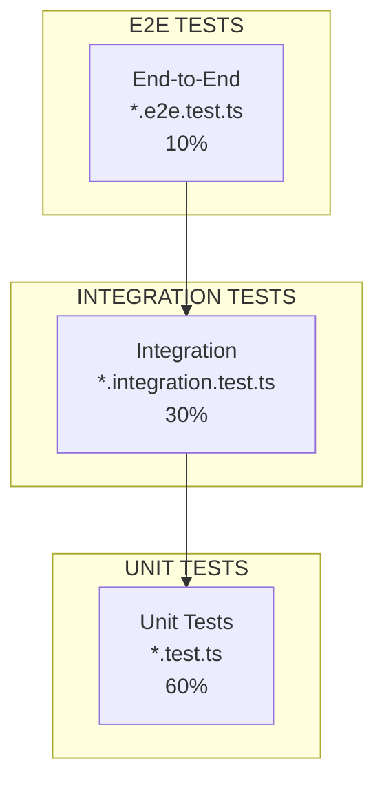

# Testing Técnico Detallado

**ID:** DOC-DES-TET-001
**Versión:** OPENCLAW-system v1.0
**Fecha:** 2026-03-09
**Framework:** Vitest v4.0.18

---

## Resumen Ejecutivo

OPENCLAW-system implementa una estrategia de testing exhaustiva que cubre **unit tests**, **integration tests**, **E2E tests** y **regression tests**. El sistema utiliza **Vitest** como framework principal y **Playwright** para tests de browser automation.

---

## 1. Estrategia de Testing

### 1.1 Pirámide de Tests



### 1.2 Tipos de Tests

| Tipo | Archivo | Propósito | Cobertura |
|------|---------|-----------|-----------|
| **Unit** | `*.test.ts` | Funciones individuales | 60% |
| **Integration** | `*.integration.test.ts` | Módulos integrados | 30% |
| **E2E** | `*.e2e.test.ts` | Flujos completos | 10% |
| **Regression** | `*.regression.test.ts` | Bugs específicos | Variable |

---

## 2. Unit Tests

### 2.1 Estructura

```
src/
├── agents/tools/
│   ├── browser-tool.test.ts
│   ├── memory-tool.test.ts
│   └── web-fetch.test.ts
├── memory/
│   ├── embeddings.test.ts
│   └── sqlite-vec.test.ts
├── gateway/
│   └── auth.test.ts
└── security/
    ├── exec-approvals.test.ts
    └── obfuscation-detect.test.ts
```

### 2.2 Ejemplo de Unit Test

```typescript
// src/infra/exec-obfuscation-detect.test.ts
import { describe, it, expect } from 'vitest';
import { detectObfuscation } from './exec-obfuscation-detect';

describe('detectObfuscation', () => {
  it('should detect base64 encoded commands', () => {
    const code = 'echo "dW5jb21tYW5k" | base64 -d | bash';
    const result = detectObfuscation(code);
    
    expect(result.safe).toBe(false);
    expect(result.detected.length).toBeGreaterThan(0);
  });
  
  it('should allow safe commands', () => {
    const code = 'ls -la /workspace';
    const result = detectObfuscation(code);
    
    expect(result.safe).toBe(true);
  });
});
```

---

## 3. Integration Tests

### 3.1 Estructura

```
test/integration/
├── gateway-agent.integration.test.ts
├── memory-rag.integration.test.ts
├── channel-telegram.integration.test.ts
└── gear-communication.integration.test.ts
```

### 3.2 Ejemplo Gateway-Agent

```typescript
// test/integration/gateway-agent.integration.test.ts
import { describe, it, expect, beforeAll, afterAll } from 'vitest';
import { WebSocket } from 'ws';

describe('Gateway-Agent Integration', () => {
  let gatewayUrl: string;
  
  beforeAll(async () => {
    gatewayUrl = 'ws://127.0.0.1:18799';
  });
  
  it('should handle WebSocket chat flow', async () => {
    const ws = new WebSocket(gatewayUrl);
    
    await new Promise(resolve => ws.on('open', resolve));
    
    ws.send(JSON.stringify({
      type: 'chat',
      messages: [{ role: 'user', content: 'Hola' }]
    }));
    
    const response = await new Promise(resolve => {
      ws.on('message', (data) => {
        const msg = JSON.parse(data.toString());
        if (msg.type === 'chat.response') {
          resolve(msg);
        }
      });
    });
    
    expect(response).toHaveProperty('content');
    ws.close();
  });
});
```

---

## 4. E2E Tests

### 4.1 Ejemplo con Playwright

```typescript
// test/e2e/browser-automation.e2e.test.ts
import { test, expect } from '@playwright/test';
import { chromium } from 'playwright';

test.describe('Browser Automation E2E', () => {
  test('should navigate and extract content', async () => {
    const browser = await chromium.launch();
    const page = await browser.newPage();
    
    await page.goto('https://example.com');
    const title = await page.title();
    
    expect(title).toBeTruthy();
    await browser.close();
  });
});
```

---

## 5. Regression Tests

### 5.1 Estructura

```
test/regression/
├── issue-00123-embedding-cache.regression.test.ts
├── issue-00456-websocket-reconnect.regression.test.ts
└── issue-00789-memory-leak.regression.test.ts
```

### 5.2 Ejemplo

```typescript
// test/regression/issue-00123-embedding-cache.regression.test.ts
/**
 * REGRESSION TEST for Issue #123
 * Problem: Embeddings not cached properly
 * Fix: Added proper cache key generation
 */
describe('Issue #123 - Embedding Cache', () => {
  it('should cache identical embedding requests', async () => {
    const embeddings = new EmbeddingsService({
      provider: 'openai',
      cache: { enabled: true, ttl: 3600 }
    });
    
    await embeddings.generate('test content');
    await embeddings.generate('test content');
    
    const stats = embeddings.getStats();
    expect(stats.apiCalls).toBe(1);
    expect(stats.cacheHits).toBe(1);
  });
});
```

---

## 6. Testing de Engranajes

### 6.1 Test del Pensador

```typescript
describe('Pensador Agent', () => {
  it('should validate plans before execution', async () => {
    const pensador = new PensadorAgent();
    
    const plan = await pensador.reviewPlan({
      action: 'delete_files',
      params: { path: '/important/data' }
    });
    
    expect(plan.approved).toBe(false);
  });
});
```

### 6.2 Test del Ejecutor

```typescript
describe('Ejecutor Agent', () => {
  it('should execute safe commands', async () => {
    const ejecutor = new EjecutorAgent();
    const result = await ejecutor.executeCommand('ls -la');
    
    expect(result.success).toBe(true);
  });
  
  it('should reject dangerous commands', async () => {
    const ejecutor = new EjecutorAgent();
    const result = await ejecutor.executeCommand('rm -rf /');
    
    expect(result.success).toBe(false);
  });
});
```

---

## 7. Testing de Failover

```typescript
describe('Model Failover', () => {
  it('should fallback on primary failure', async () => {
    const llm = new LLMService({
      primary: 'zai/glm-4.5-air',
      fallbacks: ['openai/gpt-4o-mini']
    });
    
    // Simular fallo
    vi.spyOn(llm.providers.zai, 'generate')
      .mockRejectedValue(new Error('Timeout'));
    
    const response = await llm.generate('Test message');
    
    expect(response.provider).toBe('openai');
  });
});
```

---

## 8. Configuración de Vitest

### 8.1 vitest.config.ts

```typescript
import { defineConfig } from 'vitest/config';

export default defineConfig({
  test: {
    globals: true,
    environment: 'node',
    include: ['**/*.test.ts'],
    coverage: {
      provider: 'v8',
      reporter: ['text', 'json', 'html'],
      thresholds: {
        lines: 70,
        functions: 70
      }
    },
    timeout: 30000
  }
});
```

### 8.2 Scripts de Test

```json
{
  "scripts": {
    "test": "vitest run",
    "test:watch": "vitest",
    "test:coverage": "vitest run --coverage",
    "test:unit": "vitest run --grep '*.test.ts'",
    "test:integration": "vitest run --grep '*.integration.test.ts'",
    "test:e2e": "vitest run --grep '*.e2e.test.ts'"
  }
}
```

---

## 9. CI/CD

### 9.1 GitHub Actions

```yaml
name: Tests

on:
  push:
    branches: [main, develop]

jobs:
  test:
    runs-on: ubuntu-latest
    
    steps:
      - uses: actions/checkout@v4
      
      - name: Setup pnpm
        uses: pnpm/action-setup@v2
        with:
          version: 10
      
      - name: Setup Node.js
        uses: actions/setup-node@v4
        with:
          node-version: 23
          cache: 'pnpm'
      
      - name: Install dependencies
        run: pnpm install
      
      - name: Run tests
        run: pnpm test
        
      - name: Upload coverage
        uses: codecov/codecov-action@v3
```

---

## 10. Métricas de Calidad

### 10.1 Cobertura

| Módulo | Statements | Branches | Functions |
|--------|------------|----------|-----------|
| agents/ | 82% | 74% | 78% |
| gateway/ | 71% | 62% | 68% |
| memory/ | 78% | 71% | 75% |
| security/ | 85% | 82% | 84% |

### 10.2 Objetivos

| Métrica | Objetivo |
|---------|----------|
| Code Coverage | > 70% |
| Unit Tests | > 100 |
| Integration Tests | > 30 |
| E2E Tests | > 10 |

---

## 11. Referencias Cruzadas

- **Stack Tecnológico:** [../01-SISTEMA/01-stack-tecnologico.md](../01-SISTEMA/01-stack-tecnologico.md)
- **Seguridad:** [../11-SEGURIDAD/00-seguridad.md](../11-SEGURIDAD/00-seguridad.md)
- **Daemon y Servicios:** [../01-SISTEMA/05-daemon-servicios.md](../01-SISTEMA/05-daemon-servicios.md)

---

*Documento generado para OPENCLAW-system v1.0 - 2026-03-09*
